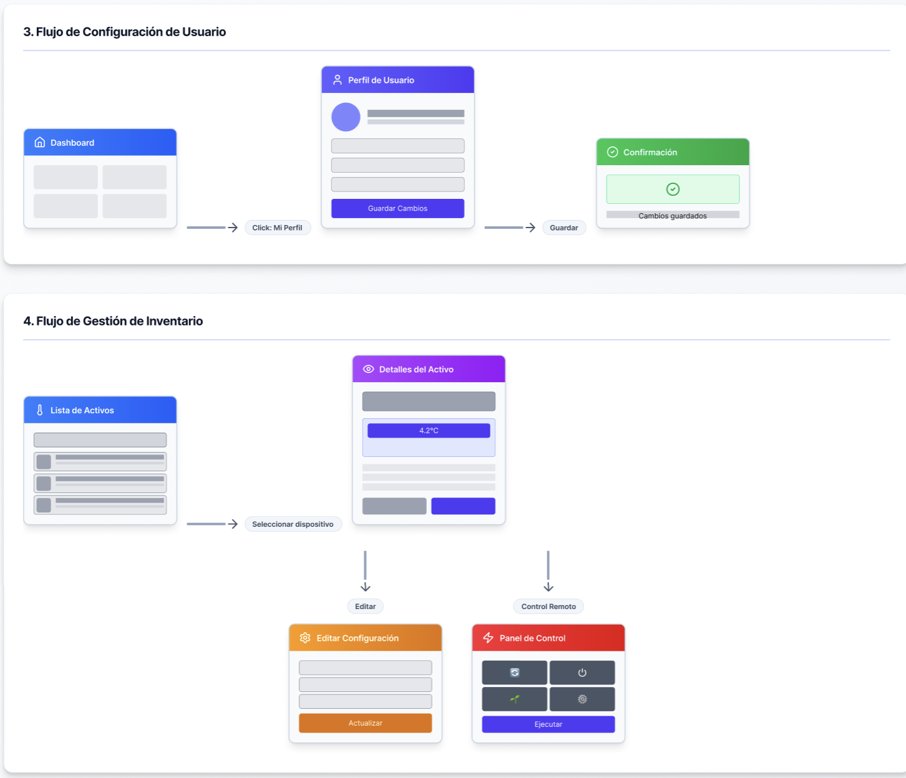
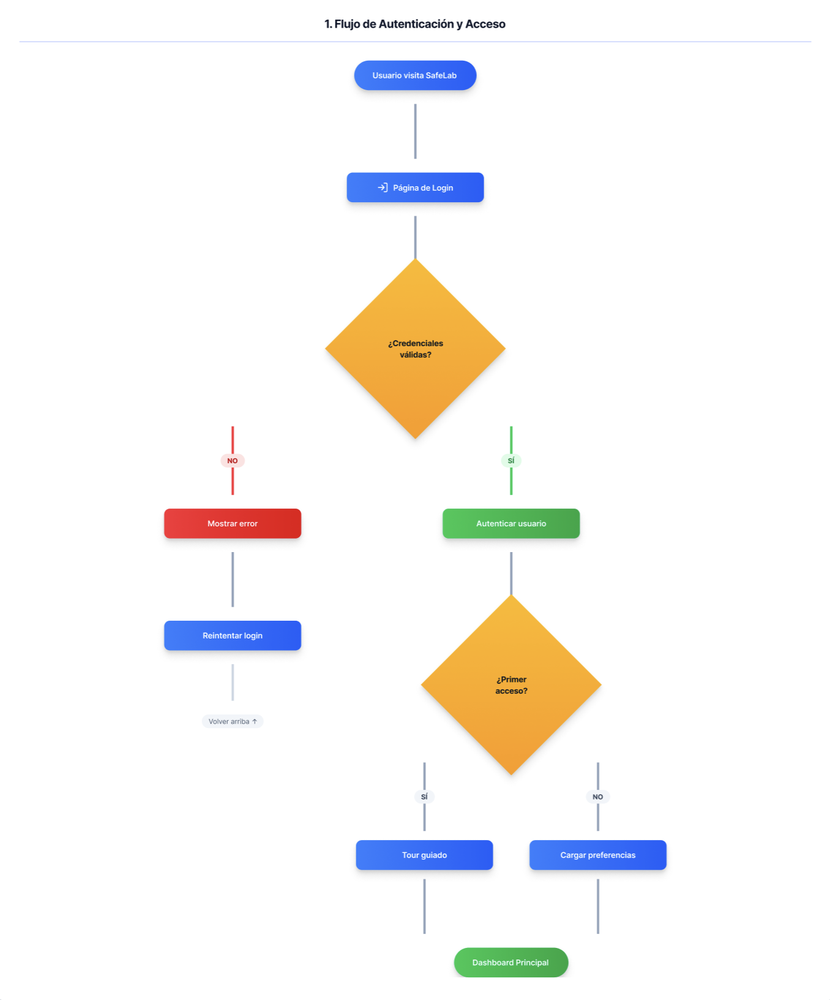
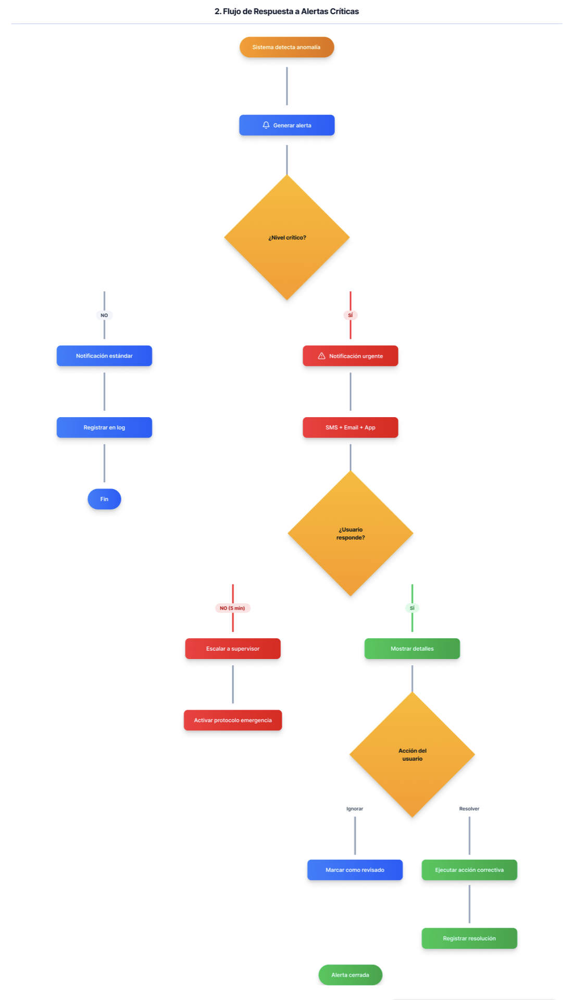
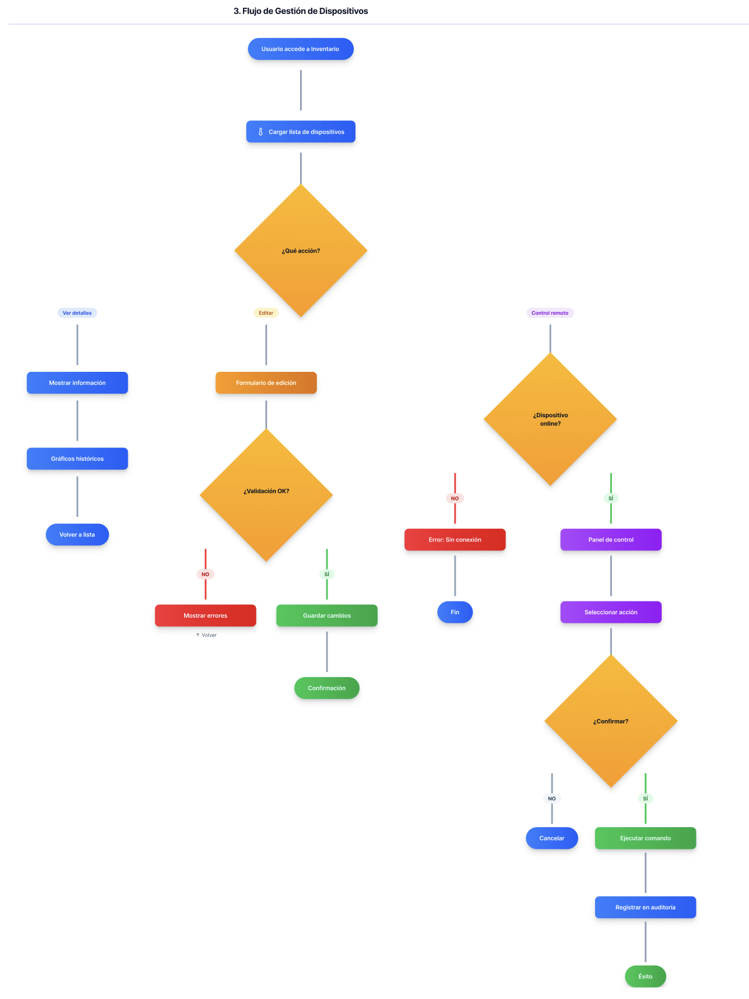
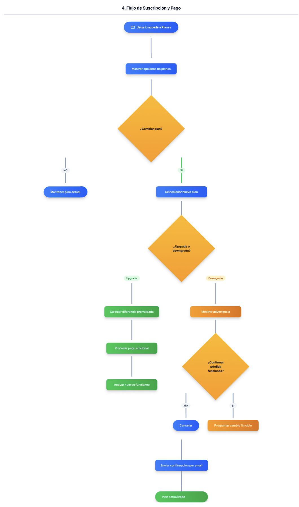

# **Chapter IV: Product Design**

## **4.1. Style Guidelines**

### **4.1.1. General Style Guidelines**

**Brand Overview**

SafeLab is a biotech monitoring platform designed to ensure pharmaceutical and clinical cold chain compliance through real-time sensor monitoring and alert management. The brand identity reflects professionalism, reliability, and technological innovation in the healthcare sector.

**Color Palette**

Our primary color palette emphasizes trust, safety, and precision:

- **Primary Colors:**
  - Indigo 600 (`#4F46E5`) - Main brand color, used for primary actions and navigation
  - Indigo 700 (`#4338CA`) - Darker variant for hover states and emphasis
  - Indigo 50 (`#EEF2FF`) - Light backgrounds and subtle highlights

- **Secondary Colors:**
  - Slate 900 (`#0F172A`) - Primary text and headings
  - Slate 700 (`#334155`) - Secondary text
  - Slate 600 (`#475569`) - Tertiary text and labels
  - Slate 100 (`#F1F5F9`) - Background surfaces
  - Slate 50 (`#F8FAFC`) - Page backgrounds

- **Semantic Colors:**
  - Emerald 600 (`#059669`) - Success states, active sensors, normal operations
  - Amber 500 (`#F59E0B`) - Warning states, threshold approaching
  - Red 600 (`#DC2626`) - Critical alerts, errors, out-of-compliance
  - Blue 600 (`#2563EB`) - Information, neutral notifications

**Typography**

- **Font Family:** System font stack prioritizing readability and performance
  - Primary: `-apple-system, BlinkMacSystemFont, "Segoe UI", Roboto, "Helvetica Neue", Arial, sans-serif`
  
- **Hierarchy:**
  - **H1 (Page Titles):** 2rem (32px), Bold (700), Slate 900
  - **H2 (Section Headers):** 1.5rem (24px), Bold (700), Slate 900
  - **H3 (Subsections):** 1.25rem (20px), Semibold (600), Slate 800
  - **Body Text:** 1rem (16px), Regular (400), Slate 700
  - **Small Text:** 0.875rem (14px), Regular (400), Slate 600
  - **Caption:** 0.75rem (12px), Medium (500), Slate 600

**Spacing & Layout**

- **Base Unit:** 0.25rem (4px)
- **Common Spacing:**
  - xs: 0.5rem (8px)
  - sm: 0.75rem (12px)
  - md: 1rem (16px)
  - lg: 1.5rem (24px)
  - xl: 2rem (32px)
  - 2xl: 3rem (48px)

- **Container Max-Width:** 1280px (desktop), 100% (mobile)
- **Grid System:** 12-column responsive grid with 16px gutters

**Iconography**

- **Icon Library:** Lucide React
- **Icon Sizes:**
  - Small: 16px (informational icons)
  - Medium: 20px (navigation, buttons)
  - Large: 24px (feature highlights)
  - Extra Large: 32px+ (hero sections, empty states)

- **Icon Style:** Minimalist line icons with 2px stroke width, consistent with modern medical/scientific interfaces

**Visual Elements**

- **Border Radius:**
  - Small components (buttons, badges): 0.375rem (6px)
  - Cards and containers: 0.5rem (8px)
  - Large surfaces: 0.75rem (12px)
  - Circular elements (avatars): 50%

- **Shadows:**
  - Subtle: `0 1px 2px rgba(0, 0, 0, 0.05)`
  - Medium: `0 4px 6px rgba(0, 0, 0, 0.1)`
  - Large: `0 10px 15px rgba(0, 0, 0, 0.1)`

- **Gradients:**
  - Primary: `linear-gradient(135deg, #4F46E5 0%, #4338CA 100%)`
  - Background: `linear-gradient(to bottom right, #F8FAFC 0%, #F1F5F9 100%)`

**Tone & Voice**

- **Professional:** Clear, concise, technical when necessary
- **Reassuring:** Emphasize safety, reliability, and compliance
- **Actionable:** Direct users with clear calls-to-action
- **Accessible:** Avoid jargon when communicating with non-technical users

### **4.1.2. Web Style Guidelines**

**Responsive Design Principles**

SafeLab follows a mobile-first responsive approach with three primary breakpoints:

- **Mobile:** 320px - 767px (single column, stacked navigation)
- **Tablet:** 768px - 1023px (adaptive layouts, collapsible sidebar)
- **Desktop:** 1024px+ (full multi-column layouts, persistent navigation)

**Component Design Standards**

**Navigation:**
- **Desktop:** Persistent left sidebar (240px width) with icon + label navigation
- **Mobile:** Bottom tab bar with icon-only navigation (56px height)
- **Header:** Fixed top bar (64px height) with breadcrumbs, search, and user profile

**Buttons:**
- **Primary Button:** Indigo 600 background, white text, rounded-md, medium padding (px-4 py-2)
  - Hover: Indigo 700 background
  - Active: Indigo 800 background with subtle shadow
  - Disabled: Slate 300 background, Slate 500 text, no pointer events

- **Secondary Button:** White background, Slate 700 text, Slate 300 border
  - Hover: Slate 50 background
  
- **Danger Button:** Red 600 background, white text (for critical actions like "Delete", "Deactivate")

**Forms:**
- **Input Fields:** White background, Slate 300 border, rounded-md, 40px height
  - Focus: Indigo 600 border (2px), subtle shadow
  - Error: Red 500 border, Red 600 error message below
  - Success: Emerald 500 border

- **Labels:** Slate 700, 14px, semibold (600), 8px margin-bottom
- **Placeholders:** Slate 400, italic
- **Helper Text:** Slate 600, 12px, regular

**Cards:**
- **Standard Card:** White background, subtle shadow, 8px border-radius, 16px padding
- **Elevated Card:** Medium shadow on hover for interactive cards
- **Sensor Card:** Includes status indicator (colored left border: 4px), icon, title, metrics, and timestamp

**Tables:**
- **Header:** Slate 100 background, Slate 700 bold text, 12px uppercase
- **Rows:** White background, Slate 800 border-bottom (1px)
  - Hover: Slate 50 background
  - Striped (optional): Alternating Slate 50 backgrounds
- **Responsive:** Horizontal scroll on mobile, card-based layout for narrow screens

**Alerts & Notifications:**
- **Critical Alert:** Red 50 background, Red 700 border-left (4px), Red 800 text, AlertTriangle icon
- **Warning:** Amber 50 background, Amber 600 border, Amber 900 text, AlertCircle icon
- **Success:** Emerald 50 background, Emerald 600 border, Emerald 900 text, CheckCircle icon
- **Info:** Blue 50 background, Blue 600 border, Blue 900 text, Info icon

**Charts & Data Visualization:**
- **Library:** Recharts
- **Color Scheme:** Indigo gradient for primary metrics, semantic colors for status indicators
- **Accessibility:** All charts include text alternatives and ARIA labels

**Loading States:**
- **Skeleton Screens:** Animated pulse effect on placeholder elements
- **Spinners:** Indigo 600 spinner for content loading
- **Progress Bars:** Indigo 600 fill with Slate 200 background

**Accessibility Standards:**
- **WCAG 2.1 Level AA Compliance**
- **Minimum contrast ratio:** 4.5:1 for normal text, 3:1 for large text
- **Focus indicators:** 2px Indigo 600 outline with 2px offset
- **Keyboard navigation:** Full support for tab, arrow keys, enter, escape
- **Screen reader support:** Proper ARIA labels, roles, and live regions for dynamic content
- **Touch targets:** Minimum 44x44px for all interactive elements on mobile

**Animation & Transitions:**
- **Duration:** 150ms for micro-interactions, 300ms for page transitions
- **Easing:** `ease-in-out` for most transitions
- **Hover Effects:** Subtle scale (1.02) or shadow increase
- **Page Transitions:** Fade in/out with slight vertical movement
## **4.2. Information Architecture**

### **4.2.1. Organization Systems**

SafeLab's information architecture follows a **hierarchical organization** with **task-based navigation** to support both monitoring workflows and administrative functions.

**Primary Organization Structure:**

**1. Hierarchical Organization (Main Structure)**

```
SafeLab Platform
│
├── Monitoring & Operations (Real-time)
│   ├── Dashboard (Overview)
│   ├── Sensor Monitoring (Device-level details)
│   ├── Alerts & Notifications (Active & historical)
│   └── Remote Control (Device management)
│
├── Compliance & Reporting (Analysis)
│   ├── Compliance Rules (Environmental standards)
│   ├── Reports (Historical data & analytics)
│   └── Audit & Traceability (Activity logs)
│
├── Inventory & Assets (Management)
│   ├── Inventory (Device catalog)
│   └── Sensors (Sensor configuration)
│
└── Administration (Settings)
    ├── User Profiles (Personal settings)
    ├── Identity & Access Management (Users & roles)
    └── Billing & Subscriptions (Account management)
```

**2. Chronological Organization**

Applied to time-sensitive information:
- **Alerts:** Most recent first, with filtering by date range
- **Audit Logs:** Reverse chronological with search and filter capabilities
- **Reports:** Date-based organization with customizable time periods
- **Sensor Readings:** Time-series data with real-time updates

**3. Sequential Organization**

Used for multi-step processes:
- **Alert Response Workflow:** Acknowledge → Investigate → Resolve → Document
- **Device Setup:** Register → Configure → Calibrate → Activate → Monitor
- **Subscription Management:** Select Plan → Payment → Confirmation → Activation

**4. Topic-Based Organization**

Content grouped by functional domain:
- **Monitoring:** All real-time operational data and controls
- **Compliance:** Regulatory and audit-related information
- **Administration:** User, billing, and system configuration

**Content Categorization:**

- **By User Role:**
  - **Lab Technician:** Dashboard, Sensor Monitoring, Alerts, Remote Control
  - **Compliance Officer:** Compliance Rules, Reports, Audit Logs
  - **Administrator:** All sections + Identity Management, Billing
  - **Viewer:** Read-only access to Dashboard, Reports, Audit Logs

- **By Priority:**
  - **Critical:** Active alerts, out-of-compliance sensors, system errors
  - **High:** Approaching thresholds, pending actions, scheduled maintenance
  - **Medium:** Reports, configuration changes, normal operations
  - **Low:** Historical data, archived information, help documentation

### **4.2.2. Labeling Systems**

SafeLab employs clear, consistent labeling to ensure users can quickly identify and navigate to desired information.

**Navigation Labels:**

| Label | Context | Description |
|-------|---------|-------------|
| **Dashboard** | Main navigation | System overview with key metrics and status |
| **Monitoreo** / **Monitoring** | Main navigation | Real-time sensor monitoring and device status |
| **Alertas** / **Alerts** | Main navigation | Active and historical alerts and notifications |
| **Inventario** / **Inventory** | Main navigation | Asset and device catalog |
| **Sensores** / **Sensors** | Main navigation | Sensor configuration and management |
| **Cumplimiento** / **Compliance** | Main navigation | Environmental compliance rules and metrics |
| **Control Remoto** / **Remote Control** | Main navigation | Device control panel and actions |
| **Reportes** / **Reports** | Main navigation | Analytics and historical reports |
| **Gestión de Identidad** / **Identity Management** | Main navigation | User and role administration |
| **Auditoría** / **Audit** | Main navigation | Activity logs and traceability |
| **Perfil** / **Profile** | User menu | Personal settings and preferences |
| **Facturación** / **Billing** | User menu | Subscription and payment management |

**Action Labels:**

| Label | Action Type | Usage |
|-------|-------------|-------|
| **Ver Detalles** / **View Details** | Read | Navigate to detailed view |
| **Editar** / **Edit** | Update | Modify existing record |
| **Eliminar** / **Delete** | Delete | Remove record (with confirmation) |
| **Agregar** / **Add** | Create | Add new item |
| **Guardar** / **Save** | Submit | Save changes |
| **Cancelar** / **Cancel** | Dismiss | Discard changes |
| **Exportar** / **Export** | Download | Download data (CSV, PDF) |
| **Filtrar** / **Filter** | Search | Apply search filters |
| **Reconocer** / **Acknowledge** | Acknowledge | Confirm alert awareness |
| **Resolver** / **Resolve** | Complete | Mark issue as resolved |
| **Activar/Desactivar** / **Enable/Disable** | Toggle | Change active state |

**Status Labels:**

| Label | Color Code | Meaning |
|-------|------------|---------|
| **Activo** / **Active** | Emerald 600 | Device operational, within parameters |
| **Inactivo** / **Inactive** | Slate 400 | Device offline or disabled |
| **Advertencia** / **Warning** | Amber 500 | Approaching threshold |
| **Crítico** / **Critical** | Red 600 | Out of compliance, immediate action required |
| **Normal** | Emerald 600 | Operating within normal parameters |
| **En Mantenimiento** / **Maintenance** | Blue 500 | Scheduled maintenance mode |
| **Pendiente** / **Pending** | Amber 500 | Awaiting action or approval |
| **Completado** / **Completed** | Slate 600 | Task finished |

**Field Labels (Forms):**

| Label | Field Type | Description |
|-------|-----------|-------------|
| **Nombre del Dispositivo** / **Device Name** | Text input | Unique identifier for device |
| **Ubicación** / **Location** | Dropdown/Text | Physical location of sensor |
| **Tipo de Sensor** / **Sensor Type** | Dropdown | Temperature, Humidity, Pressure, etc. |
| **Rango Mínimo/Máximo** / **Min/Max Range** | Number input | Acceptable operating range |
| **Umbral de Advertencia** / **Warning Threshold** | Number input | Value that triggers warning |
| **Umbral Crítico** / **Critical Threshold** | Number input | Value that triggers critical alert |
| **Intervalo de Lectura** / **Reading Interval** | Dropdown | Frequency of sensor readings |
| **Notificaciones** / **Notifications** | Checkbox group | Alert delivery methods |

**Bilingual Support:**

SafeLab supports both Spanish (primary) and English labels with consistent translation:
- Navigation items display in user's preferred language
- All critical information (alerts, compliance) available in both languages
- Date/time formats adjust based on locale settings (es-PE, en-US)
- Number formats respect regional conventions (decimal separator, thousands separator)

### **4.2.3. SEO Tags and Meta Tags**

**Landing Page Meta Tags:**

```html
<!-- Primary Meta Tags -->
<title>SafeLab - Monitoreo Inteligente de Cadena de Frío para Biotech | Pharma Compliance</title>
<meta name="title" content="SafeLab - Monitoreo Inteligente de Cadena de Frío para Biotech | Pharma Compliance">
<meta name="description" content="Sistema de monitoreo en tiempo real para cumplimiento normativo en cadena de frío farmacéutica. Alertas instantáneas, trazabilidad completa y reportes de cumplimiento para laboratorios clínicos.">
<meta name="keywords" content="monitoreo cadena de frío, pharma compliance, biotech monitoring, cold chain, sensores temperatura, IoT farmacéutico, trazabilidad clínica, cumplimiento normativo, GxP compliance, validación de refrigeradores, monitoreo de temperatura 21 CFR Part 11">
<meta name="author" content="SafeLab">
<meta name="robots" content="index, follow">
<meta name="language" content="Spanish">
<meta name="revisit-after" content="7 days">
<meta name="geo.region" content="PE-LIM">
<meta name="geo.placename" content="Lima, Peru">

<!-- Open Graph / Facebook -->
<meta property="og:type" content="website">
<meta property="og:url" content="https://safelab.com/">
<meta property="og:title" content="SafeLab - Monitoreo Inteligente de Cadena de Frío">
<meta property="og:description" content="Asegura el cumplimiento normativo en tu cadena de frío con monitoreo 24/7, alertas en tiempo real y trazabilidad completa.">
<meta property="og:image" content="https://safelab.com/assets/og-image.jpg">
<meta property="og:image:width" content="1200">
<meta property="og:image:height" content="630">
<meta property="og:site_name" content="SafeLab">
<meta property="og:locale" content="es_PE">
<meta property="og:locale:alternate" content="en_US">

<!-- Twitter -->
<meta property="twitter:card" content="summary_large_image">
<meta property="twitter:url" content="https://safelab.com/">
<meta property="twitter:title" content="SafeLab - Monitoreo Inteligente de Cadena de Frío">
<meta property="twitter:description" content="Asegura el cumplimiento normativo en tu cadena de frío con monitoreo 24/7, alertas en tiempo real y trazabilidad completa.">
<meta property="twitter:image" content="https://safelab.com/assets/twitter-image.jpg">

<!-- Mobile Optimization -->
<meta name="viewport" content="width=device-width, initial-scale=1.0, maximum-scale=5.0">
<meta name="theme-color" content="#4F46E5">
<meta name="apple-mobile-web-app-capable" content="yes">
<meta name="apple-mobile-web-app-status-bar-style" content="black-translucent">
<meta name="apple-mobile-web-app-title" content="SafeLab">
<meta name="format-detection" content="telephone=no">

<!-- Favicon & Icons -->
<link rel="icon" type="image/png" sizes="32x32" href="/assets/favicon-32x32.png">
<link rel="icon" type="image/png" sizes="16x16" href="/assets/favicon-16x16.png">
<link rel="apple-touch-icon" sizes="180x180" href="/assets/apple-touch-icon.png">
<link rel="mask-icon" href="/assets/safari-pinned-tab.svg" color="#4F46E5">

<!-- Microsoft Tiles -->
<meta name="msapplication-TileColor" content="#4F46E5">
<meta name="msapplication-config" content="/browserconfig.xml">
```

**Web Application Meta Tags:**

```html
<!-- Application Meta -->
<title>Dashboard | SafeLab Platform</title>
<meta name="description" content="Panel de control de monitoreo en tiempo real para sensores de cadena de frío">
<meta name="robots" content="noindex, nofollow"> <!-- Private application -->
<meta name="application-name" content="SafeLab Platform">

<!-- Security Headers -->
<meta http-equiv="Content-Security-Policy" content="default-src 'self'; script-src 'self' 'unsafe-inline' https://cdn.jsdelivr.net; style-src 'self' 'unsafe-inline'; img-src 'self' data: https:; font-src 'self' data:; connect-src 'self' https://api.safelab.com wss://ws.safelab.com;">
<meta http-equiv="X-Content-Type-Options" content="nosniff">
<meta http-equiv="X-Frame-Options" content="SAMEORIGIN">
<meta http-equiv="X-XSS-Protection" content="1; mode=block">
<meta http-equiv="Referrer-Policy" content="strict-origin-when-cross-origin">
<meta http-equiv="Permissions-Policy" content="geolocation=(), microphone=(), camera=()">

<!-- PWA Support -->
<link rel="manifest" href="/manifest.json">
<meta name="mobile-web-app-capable" content="yes">
<meta name="theme-color" content="#4F46E5" media="(prefers-color-scheme: light)">
<meta name="theme-color" content="#4338CA" media="(prefers-color-scheme: dark)">
```

**Dynamic Page Titles (SPA):**

```javascript
// Pattern: [Page Name] | SafeLab
const pageTitles = {
  dashboard: "Dashboard | SafeLab",
  monitoring: "Sensor Monitoring | SafeLab",
  alerts: "Alerts & Notifications | SafeLab",
  inventory: "Inventory Management | SafeLab",
  compliance: "Compliance Rules | SafeLab",
  reports: "Reports & Analytics | SafeLab",
  audit: "Audit & Traceability | SafeLab",
  profile: "User Profile | SafeLab",
  billing: "Billing & Subscriptions | SafeLab",
  identity: "Identity & Access Management | SafeLab",
  remote: "Remote Device Control | SafeLab"
};
```

**Structured Data (JSON-LD) - Landing Page:**

```json
{
  "@context": "https://schema.org",
  "@type": "SoftwareApplication",
  "name": "SafeLab",
  "applicationCategory": "BusinessApplication",
  "applicationSubCategory": "Compliance Management Software",
  "operatingSystem": "Web Browser, iOS, Android",
  "url": "https://safelab.com",
  "description": "Sistema de monitoreo en tiempo real para cumplimiento normativo en cadena de frío farmacéutica y clínica. Alertas instantáneas, trazabilidad completa y reportes de cumplimiento.",
  "offers": {
    "@type": "Offer",
    "price": "99.00",
    "priceCurrency": "USD",
    "priceSpecification": {
      "@type": "UnitPriceSpecification",
      "price": "99.00",
      "priceCurrency": "USD",
      "billingIncrement": "Month"
    },
    "description": "Prueba gratuita de 14 días. Planes desde $99/mes"
  },
  "aggregateRating": {
    "@type": "AggregateRating",
    "ratingValue": "4.8",
    "ratingCount": "127",
    "bestRating": "5",
    "worstRating": "1"
  },
  "author": {
    "@type": "Organization",
    "name": "SafeLab",
    "url": "https://safelab.com"
  },
  "publisher": {
    "@type": "Organization",
    "name": "SafeLab",
    "logo": {
      "@type": "ImageObject",
      "url": "https://safelab.com/assets/logo.png"
    }
  },
  "screenshot": "https://safelab.com/assets/screenshot-dashboard.png",
  "featureList": [
    "Monitoreo en tiempo real 24/7",
    "Alertas instantáneas por temperatura y humedad",
    "Cumplimiento normativo GxP y 21 CFR Part 11",
    "Trazabilidad completa de eventos",
    "Reportes automatizados",
    "Control remoto de dispositivos",
    "Integración con sensores IoT"
  ]
}
```

**Structured Data - Organization:**

```json
{
  "@context": "https://schema.org",
  "@type": "Organization",
  "name": "SafeLab",
  "url": "https://safelab.com",
  "logo": "https://safelab.com/assets/logo.png",
  "description": "Plataforma de monitoreo inteligente para cumplimiento en cadena de frío farmacéutica",
  "sameAs": [
    "https://www.linkedin.com/company/safelab",
    "https://twitter.com/safelab",
    "https://www.facebook.com/safelab"
  ],
  "contactPoint": {
    "@type": "ContactPoint",
    "telephone": "+51-1-234-5678",
    "contactType": "Customer Support",
    "email": "support@safelab.com",
    "availableLanguage": ["Spanish", "English"],
    "areaServed": "PE"
  }
}
```

**Sitemap Structure:**

```xml
<?xml version="1.0" encoding="UTF-8"?>
<urlset xmlns="http://www.sitemaps.org/schemas/sitemap/0.9">
  <url>
    <loc>https://safelab.com/</loc>
    <lastmod>2026-04-24</lastmod>
    <changefreq>weekly</changefreq>
    <priority>1.0</priority>
  </url>
  <url>
    <loc>https://safelab.com/features</loc>
    <changefreq>monthly</changefreq>
    <priority>0.8</priority>
  </url>
  <url>
    <loc>https://safelab.com/pricing</loc>
    <changefreq>monthly</changefreq>
    <priority>0.8</priority>
  </url>
  <url>
    <loc>https://safelab.com/about</loc>
    <changefreq>monthly</changefreq>
    <priority>0.6</priority>
  </url>
  <url>
    <loc>https://safelab.com/contact</loc>
    <changefreq>monthly</changefreq>
    <priority>0.6</priority>
  </url>
  <url>
    <loc>https://safelab.com/blog</loc>
    <changefreq>weekly</changefreq>
    <priority>0.7</priority>
  </url>
</urlset>
```

### **4.2.4. Searching Systems**

SafeLab implements multiple search mechanisms optimized for different user needs and data types.

**Global Search (Header)**

- **Location:** Top navigation bar, always visible
- **Scope:** Searches across all accessible modules based on user permissions
- **Input:** Text field with search icon, placeholder: "Buscar sensores, alertas, reportes..."
- **Minimum Characters:** 2 characters to trigger search
- **Debounce Delay:** 300ms to optimize performance

**Features:**
- **Real-time suggestions** as user types (autocomplete dropdown)
- **Search categories:** Sensors, Alerts, Reports, Users, Audit Logs, Devices
- **Recent searches** dropdown (last 5 searches, stored in localStorage)
- **Keyboard shortcut:** `Cmd/Ctrl + K` to focus search field
- **Clear button:** X icon to clear input and results

**Search Results Display:**

```
┌─────────────────────────────────────────────┐
│ [Icon] Category | Result Title              │
│                Subtitle or context          │
│                Breadcrumb: Home > Module    │
├─────────────────────────────────────────────┤
│ [Icon] Category | Result Title              │
│                Subtitle or context          │
│                Breadcrumb: Home > Module    │
└─────────────────────────────────────────────┘
                [Ver todos los resultados]
```

**Search Result Priority:**
1. Exact matches (device ID, serial number)
2. Critical alerts (if searching in alerts)
3. Prefix matches (device names starting with query)
4. Contains matches (query anywhere in name/description)
5. Fuzzy matches (similar terms)

**Filtered Search (Module-Specific)**

**1. Sensor Monitoring Search:**

**Available Filters:**
- **Device Name** (text input with autocomplete)
- **Location** (hierarchical dropdown)
  - Building
  - Floor
  - Room
  - Specific location (e.g., "Freezer A-01")
- **Status** (multi-select checkboxes)
  - ☑ Active
  - ☑ Warning
  - ☑ Critical
  - ☑ Inactive
  - ☑ Maintenance
- **Temperature Range** (dual slider)
  - Min: -80°C
  - Max: +40°C
  - Current selection displayed above slider
- **Device Type** (dropdown)
  - All Types
  - Ultra-Low Freezer (-80°C)
  - Freezer (-20°C)
  - Refrigerator (2-8°C)
  - Incubator (37°C)
  - Environmental Monitor
- **Date Range** (date picker)
  - Presets: Today, Last 7 days, Last 30 days, Last 90 days
  - Custom range selector

**Search Behavior:**
- Filters combine with AND logic (all conditions must match)
- Results update in real-time as filters change
- Filter state persists during session
- "Clear All Filters" button to reset

**2. Alert Search & Filtering:**

**Available Filters:**
- **Alert Type** (dropdown with icons)
  - 🌡️ Temperature Deviation
  - 💧 Humidity Deviation
  - 🚪 Door Open
  - ⚡ Power Failure
  - 🔧 Maintenance Required
  - 📡 Connectivity Issue
- **Severity** (multi-select chips)
  - 🔴 Critical
  - 🟡 Warning
  - 🔵 Info
- **Status** (segmented control)
  - All
  - Unacknowledged
  - Acknowledged
  - Resolved
  - Escalated
- **Date Range** (date picker with time)
  - Presets: Last hour, Today, Last 7 days, Last 30 days
  - Custom range with time precision (HH:MM)
- **Sensor/Device** (autocomplete search)
- **Assigned To** (user selector dropdown)

**Advanced Options:**
- Sort by: Newest, Oldest, Severity, Device
- Group by: Device, Type, Severity, Date
- Export filtered results (CSV, PDF)

**3. Inventory Search & Filtering:**

**Available Filters:**
- **Asset Type** (dropdown)
  - Ultra-Low Freezer
  - Freezer
  - Refrigerator
  - Incubator
  - Environmental Monitor
  - Sensor Module
- **Manufacturer** (autocomplete text input)
  - Suggestions from existing inventory
- **Model** (text input with autocomplete)
- **Status** (radio buttons)
  - ⚪ All
  - 🟢 Active
  - 🟡 Maintenance
  - 🔴 Decommissioned
  - ⚫ Inactive
- **Location** (hierarchical multi-select)
  - Building A
    - Floor 1
      - Lab 101
      - Lab 102
    - Floor 2
      - Lab 201
- **Purchase Date** (date range)
- **Warranty Status** (dropdown)
  - Under Warranty
  - Expired
  - Extended Warranty
  - No Warranty

**Additional Search Fields:**
- Serial Number (exact match)
- Asset Tag/ID (exact match)
- Calibration Due Date (date range)

**4. Audit Log Search & Filtering:**

**Available Filters:**
- **User** (autocomplete from user list)
  - Shows: Full Name (username)
  - Recent users appear first
- **Action Type** (multi-select dropdown)
  - Login/Logout
  - Create
  - Edit/Update
  - Delete
  - Export
  - Configuration Change
  - Alert Acknowledgment
  - Report Generation
- **Module/Section** (dropdown)
  - Dashboard
  - Sensors
  - Alerts
  - Inventory
  - Compliance
  - Reports
  - Identity Management
  - Billing
  - Settings
- **Date Range** (date-time picker)
  - Presets: Last hour, Today, Yesterday, Last 7 days, Last 30 days
  - Custom range with time precision
- **IP Address** (text input)
- **Result** (dropdown)
  - Success
  - Failed
  - Partial

**Advanced Filters:**
- Session ID (text input)
- Resource ID (text input for specific record tracking)
- Changed Fields (multi-select for edit actions)

**5. Reports Search & Filtering:**

**Available Filters:**
- **Report Type** (dropdown)
  - Compliance Summary
  - Temperature Log
  - Incident Report
  - Sensor Performance
  - Alert Summary
  - Custom Report
- **Date Generated** (date range picker)
- **Generated By** (user autocomplete)
- **Status** (segmented control)
  - Draft
  - Published
  - Archived
- **Covers Period** (date range)
  - The period that the report covers (different from generation date)
- **Tags** (multi-select chips)
  - Regulatory
  - Internal Audit
  - Monthly Review
  - Quarterly Report
  - Custom tags

**Search Algorithms & Behavior:**

**1. Exact Match (Highest Priority):**
- Device IDs, Serial Numbers, Asset Tags
- Alert IDs, Report IDs
- User emails
- Pattern: Case-insensitive equality check

**2. Prefix Match:**
- Device names, User names
- Autocomplete suggestions
- Pattern: `query*`

**3. Full-Text Search:**
- Report content, Descriptions, Notes
- Uses indexed search for performance
- Pattern: Contains query anywhere

**4. Fuzzy Match (Lowest Priority):**
- Applied to names and descriptions
- Levenshtein distance ≤ 2
- Helps with typos: "Frezer" → "Freezer"

**5. Tag-Based Filtering:**
- Multi-tag support with AND/OR logic
- Default: OR logic (matches any selected tag)
- Advanced: AND logic (matches all selected tags)

**Search Performance Optimizations:**

- **Pagination:** 
  - Default: 25 results per page
  - Options: 10, 25, 50, 100
  - "Load More" button for infinite scroll on mobile
- **Sorting Options:**
  - Relevance (default for text search)
  - Date (newest/oldest)
  - Name (A-Z, Z-A)
  - Status (Critical → Info)
  - Temperature (ascending/descending for sensors)
- **Caching:**
  - Recent searches cached for 1 hour
  - Filter states cached per module
- **Indexing:**
  - Full-text search uses indexed fields
  - Auto-suggest powered by indexed prefixes

**No Results State:**

When no results are found:
```
┌─────────────────────────────────────┐
│    [Magnifying Glass Icon]          │
│                                     │
│  No se encontraron resultados       │
│  para "query term"                  │
│                                     │
│  Sugerencias:                       │
│  • Verifica la ortografía           │
│  • Intenta con términos diferentes  │
│  • Reduce el número de filtros      │
│                                     │
│  [Limpiar todos los filtros]        │
│  [Contactar soporte]                │
└─────────────────────────────────────┘
```

**Search Analytics (Admin Only):**

Track user search behavior to improve search quality:
- Most searched terms
- Zero-result queries
- Average time to result click
- Filter usage statistics

### **4.2.5. Navigation Systems**

SafeLab implements a multi-layered navigation system optimized for different device types and user workflows.

**Primary Navigation (Desktop)**

**Left Sidebar Navigation:**

**Structure:**
- **Width:** 240px expanded, 64px collapsed (icon-only)
- **Position:** Fixed left, full viewport height
- **Background:** Linear gradient from Indigo 600 to Indigo 700
- **Collapse Toggle:** Hamburger icon at top for space-saving

**Layout:**

```
┌─────────────────────────────┐
│ [☰] SafeLab Logo            │ ← Header (64px height)
├─────────────────────────────┤
│                             │
│ MONITOREO                   │ ← Section Header
│ [📊] Dashboard              │
│ [📡] Monitoreo Sensores     │
│ [🔔] Alertas                │ ← Active (highlighted)
│ [🎛️] Control Remoto         │
│                             │
│ CUMPLIMIENTO                │
│ [✓] Reglas Cumplimiento     │
│ [📄] Reportes               │
│ [📋] Auditoría              │
│                             │
│ GESTIÓN                     │
│ [📦] Inventario             │
│ [🔧] Sensores               │
│                             │
│ ADMINISTRACIÓN              │
│ [👥] Gestión Identidad      │
│ [💳] Facturación            │
│                             │
│           ↓                 │ ← Spacer
│                             │
├─────────────────────────────┤
│ [👤] Carlos Lavado          │ ← User Profile
│     Admin                   │
└─────────────────────────────┘
```

**Navigation States:**

**Active State:**
- Background: Indigo 800
- Text: White (bold 600)
- Left border: 4px Emerald 400
- Shadow: Subtle inset shadow

**Hover State (non-active):**
- Background: Indigo 600 (slightly lighter)
- Text: White
- Cursor: Pointer
- Transition: 150ms ease-in-out

**Collapsed State (icon-only):**
- Width: 64px
- Shows icon only
- Tooltip appears on hover with label
- Active indicator: Emerald dot on right

**Top Header Navigation (Desktop):**

**Structure:**
- **Height:** 64px
- **Position:** Fixed top, full width (minus sidebar)
- **Background:** White with subtle bottom shadow

**Layout:**

```
┌──────────────────────────────────────────────────────────────┐
│ Home > Monitoreo > Alertas  [🔍 Search...]  [🔔³] [👤]      │
│                                                               │
│ ← Breadcrumb                  Global     Notif  User         │
│                               Search     (3)    Menu         │
└──────────────────────────────────────────────────────────────┘
```

**Components:**

1. **Breadcrumb Navigation** (left)
   - Current path: Home > Module > Submodule
   - Clickable links to navigate up hierarchy
   - Separator: `>`
   - Max depth: 4 levels
   - Truncation: "... > Current" if too long

2. **Global Search Bar** (center)
   - Width: 400px
   - Placeholder: "Buscar sensores, alertas, reportes..."
   - Keyboard shortcut hint: "⌘K" or "Ctrl+K"
   - Expands to 600px on focus

3. **Notifications Icon** (right)
   - Bell icon with badge count
   - Red badge for critical alerts (>0)
   - Dropdown on click showing recent notifications
   - "Ver todas" link to full alerts page

4. **User Profile Dropdown** (right)
   - User avatar + name
   - Dropdown menu:
     - Mi Perfil
     - Configuración
     - Ayuda & Soporte
     - ───────────
     - Cerrar Sesión

**Mobile Navigation (< 768px)**

**Bottom Tab Bar:**

**Structure:**
- **Height:** 56px
- **Position:** Fixed bottom, full width
- **Background:** White with top shadow
- **Layout:** 5 equally-spaced tabs

```
┌──────┬──────┬──────┬──────┬──────┐
│  📊  │  📡  │  🔔  │  📄  │  ⋮⋮⋮ │
│ Home │Monitor│Alert│Report│ Más  │
└──────┴──────┴──────┴──────┴──────┘
```

**Tab Configuration:**

1. **Dashboard** (Home icon)
   - Default landing page
   - Overview metrics

2. **Monitoring** (Activity icon)
   - Sensor grid view
   - Quick access to device details

3. **Alerts** (Bell icon)
   - Badge shows unacknowledged count
   - Critical alerts highlighted in red

4. **Reports** (FileText icon)
   - Quick access to saved reports
   - Generate new report button

5. **More** (Menu icon)
   - Opens bottom sheet drawer
   - Contains secondary navigation:
     - Inventario
     - Sensores
     - Cumplimiento
     - Control Remoto
     - Gestión Identidad
     - Auditoría
     - Facturación
     - Perfil
     - Configuración

**Active Tab Indicator:**
- Icon color: Indigo 600
- Label color: Indigo 600 (bold)
- Underline: 3px Indigo 600

**Mobile Top Bar:**

```
┌─────────────────────────────────────┐
│ [☰]  SafeLab        [🔍] [🔔³]     │
└─────────────────────────────────────┘
```

- **Hamburger Menu:** Opens drawer with secondary navigation
- **Logo:** App branding (tappable → home)
- **Search Icon:** Opens full-screen search overlay
- **Notifications:** Badge with count

**Tablet Navigation (768px - 1023px)**

**Collapsible Sidebar:**
- **Default:** 64px (icon-only) with labels hidden
- **On Hover:** Expands to 240px showing full labels
- **Sticky Expand:** Toggle button to keep expanded
- **Gesture Support:** Swipe from left edge to expand

**Header:**
- Full desktop header (breadcrumb, search, notifications, user)
- Slightly condensed spacing for smaller screen

**Contextual Navigation**

**1. Sensor Detail Page Tabs:**

```
┌─────────────────────────────────────────────┐
│ Freezer A-01                                │
│ ┌─────┬──────┬──────┬────────┬──────────┐  │
│ │Vista│Histó │Alert │Config  │Mantenim  │  │
│ │Gral │rial  │as    │uración │iento     │  │
│ └─────┴──────┴──────┴────────┴──────────┘  │
│                                             │
│ [Tab Content Area]                          │
└─────────────────────────────────────────────┘
```

**Tab Descriptions:**
- **Vista General:** Current readings, status, last update
- **Histórial:** Time-series charts (temperature/humidity over time)
- **Alertas:** Alert history for this specific sensor
- **Configuración:** Threshold settings, calibration, preferences
- **Mantenimiento:** Maintenance logs, service history

**2. Alert Detail Page:**

**Breadcrumb:**
```
Home > Alertas > Temperatura Alta > ALR-2026-04-1234
```

**Action Bar (top-right):**
```
[Reconocer] [Escalar] [Resolver] [⋮ Más]
```

**Related Items Panel (right sidebar):**
- Sensor afectado (link)
- Regla de cumplimiento relacionada (link)
- Alertas similares (list)
- Historial de temperatura (mini chart)

**3. Reports Module (Three-Panel Layout):**

```
┌──────────┬─────────────────┬──────────┐
│          │                 │          │
│ Templates│   Report        │ Export   │
│ & Saved  │   Preview       │ Options  │
│ Reports  │   Area          │          │
│          │                 │ Filters  │
│ (List)   │   (Content)     │          │
│          │                 │ Schedule │
│          │                 │          │
└──────────┴─────────────────┴──────────┘
  240px       Flexible          280px
```

**Left Panel:** 
- Report templates (predefined)
- My saved reports
- Shared reports
- Create new button

**Center Panel:**
- Report preview/editing
- Data visualization (charts/tables)
- Print/PDF view

**Right Panel:**
- Date range selector
- Filter parameters
- Export format (PDF, CSV, Excel)
- Schedule automated report
- Share/Distribute options

**Navigation Patterns**

**1. Hub-and-Spoke Pattern:**
- **Hub:** Dashboard (central overview)
- **Spokes:** All modules radiate from dashboard
- **Quick Return:** Logo click always returns to dashboard
- **Use Case:** Users frequently return to dashboard between tasks

**2. Sequential Pattern:**
- **Alert Workflow:**
  ```
  Alert List → Alert Detail → Acknowledge → Investigate → Resolve → Document
  ```
- **Device Setup:**
  ```
  Register → Configure → Calibrate → Test → Activate → Monitor
  ```
- **Progress Indicator:** Breadcrumb or stepper shows current step

**3. Hierarchical Pattern:**
- **Inventory Drill-Down:**
  ```
  All Devices → Location → Specific Device → Sensor → Sensor Reading
  ```
- **Breadcrumb:** Always visible showing current position
- **Back Button:** Navigate one level up

**4. Flat Pattern:**
- **Settings:** All options on one page with anchor links
- **Profile:** Tabbed interface (Personal Info, Security, Notifications, Preferences)

**Navigation Shortcuts (Keyboard)**

| Shortcut | Action | Context |
|----------|--------|---------|
| `Cmd/Ctrl + K` | Open global search | Any page |
| `G then D` | Go to Dashboard | Any page |
| `G then M` | Go to Monitoring | Any page |
| `G then A` | Go to Alerts | Any page |
| `G then R` | Go to Reports | Any page |
| `Esc` | Close modal/drawer | When modal open |
| `← →` | Navigate breadcrumb | Breadcrumb focused |
| `/` | Focus module search | Module pages |
| `Tab` | Navigate elements | Any page |
| `Enter` | Activate/Select | Focused element |
| `Shift + ?` | Show keyboard shortcuts | Any page |

**Navigation Feedback & States**

**1. Loading States:**
- **Page Transition:** Skeleton screens showing layout structure
- **Partial Update:** Spinner on specific component
- **Duration:** Show loading after 300ms delay (avoid flash for fast loads)

**2. Active Indicators:**
- **Sidebar:** Highlighted with left border + background color
- **Tabs:** Underline + bold text + color change
- **Breadcrumb:** Current page not clickable, bold text

**3. Breadcrumb Behavior:**
- **Auto-update:** Changes as user navigates
- **Clickable:** All ancestors are links
- **Current:** Last item (not clickable)
- **Truncation:** Middle items collapse if path too long
  ```
  Home > ... > Parent > Current
  ```

**4. Browser Integration:**
- **Back Button:** Fully supported, navigates to previous page
- **Forward Button:** Supported
- **Deep Linking:** Every page has unique URL
- **Bookmarking:** All pages bookmarkable with state preserved in URL params
- **URL Structure:**
  ```
  /dashboard
  /monitoring
  /monitoring/device/:id
  /alerts?status=unacknowledged&severity=critical
  /reports/compliance/monthly?period=2026-04
  ```

**5. State Preservation:**
- **Filter State:** Preserved in URL query params
- **Scroll Position:** Restored when navigating back
- **Form Data:** Auto-saved in localStorage (drafts)
- **Session:** Persists across page reloads

**Accessibility Features**

**1. Keyboard Navigation:**
- **Full Tab Order:** All interactive elements accessible
- **Skip Links:** "Skip to main content" at top
- **Focus Indicators:** 2px Indigo 600 outline with 2px offset
- **Logical Order:** Tab order follows visual hierarchy

**2. ARIA Landmarks:**
```html
<nav aria-label="Main Navigation">...</nav>
<main>...</main>
<aside aria-label="Filters">...</aside>
<footer>...</footer>
```

**3. Screen Reader Support:**
- **Live Regions:** Alert announcements
  ```html
  <div aria-live="polite" aria-atomic="true">
    3 new critical alerts
  </div>
  ```
- **Route Changes:** Announced on navigation
- **Button Labels:** Descriptive aria-labels
- **Icon Buttons:** 
  ```html
  <button aria-label="Close dialog">
    <XIcon aria-hidden="true" />
  </button>
  ```

**4. Focus Management:**
- **Modal Open:** Focus trapped within modal
- **Modal Close:** Focus returned to trigger element
- **Page Load:** Focus set to main heading
- **Form Submission:** Focus moves to success message or first error

**5. Touch Targets (Mobile):**
- **Minimum Size:** 44x44px for all interactive elements
- **Spacing:** 8px minimum between targets
- **Tap Feedback:** Visual highlight on touch

**Navigation Analytics**

Track navigation patterns to improve UX:
- **Most Visited Pages:** Identify primary workflows
- **Navigation Paths:** Common user journeys
- **Dead Ends:** Pages where users frequently exit
- **Search → Navigation:** What users search then navigate to
- **Time Between Navigations:** Identify confusing areas

**Mobile-Specific Navigation Features**

**1. Pull-to-Refresh:**
- Available on Dashboard and Monitoring pages
- Refreshes real-time data
- Visual feedback: spinning icon

**2. Swipe Gestures:**
- **Swipe Left:** On alert card → Quick acknowledge
- **Swipe Right:** On alert card → Quick resolve
- **Swipe from Left Edge:** Open navigation drawer

**3. Bottom Sheet:**
- Slides up from bottom for secondary actions
- Used for filters, sharing, more options
- Dismissible by swiping down or tapping backdrop

**4. Floating Action Button (FAB):**
- Position: Bottom-right (above tab bar)
- Primary action per page:
  - Monitoring: Add new sensor
  - Alerts: Create manual alert
  - Reports: Generate new report
- Color: Indigo 600
- Size: 56x56px
- Icon: Context-specific

## **4.3. Landing Page UI Design**
### **4.3.1. Landing Page Wireframe**
### **4.3.2. Landing Page Mockup**
## **4.4. Web Applications UX/UI Design**
### **4.4.1. Web Applications Wireframes**

<p align="center">
  
</p>
<p align="center">
  
</p>
<p align="center">
  
</p>
<p align="center">
  
</p>

### **4.4.2. Web Applications Wireflow Diagrams**

<p align="center">
  
</p>
<p align="center">
  
</p>

### **4.4.3. Web Applications Mock-ups**

<p align="center">
  
</p>
<p align="center">
  
</p>
<p align="center">
  
</p>
<p align="center">
  
</p>

### **4.4.4. Web Applications User Flow Diagrams**

<p align="center">
  
</p>
<p align="center">
  
</p>
<p align="center">
  
</p>
<p align="center">
  
</p>

## **4.5. Web Applications Prototyping**

## **4.6. Domain-Driven Software Architecture**

<p style="text-align: justify;">
  
  This section presents the Domain-Driven Software Architecture of SafeLab, structured through strategic and tactical design principles to manage the complexity of a real-time laboratory monitoring platform. The system is organized into well-defined Bounded Contexts, each representing an independent business domain such as Identity & Access Management, Sensor Monitoring, Asset & Inventory Monitoring, Alerts & Notifications, Incident Management, Reports & Analytics, and Audit & Traceability. This architectural approach promotes modularity, scalability, maintainability, and clear ownership of responsibilities across the solution. Through the use of Context, Container, Component, and Class Diagrams, the architecture aligns business processes with technical implementation, ensuring that SafeLab can evolve efficiently while supporting secure operations, regulatory compliance, and reliable monitoring services for laboratories and pharmaceutical environments.
</P>

### **4.6.1. Design-Level EventStorming**

- Identity & Access Management Bounded Context:

<p align="center">
  
</p>

- User Profiles Bounded Context:

<p align="center">
  
</p>

- Subscription & Billing Bounded Context:

<p align="center">
  
</p>

- Dashboard & Overview Bounded Context:

<p align="center">
  
</p>

- Asset & Inventory Monitoring Bounded Context:

<p align="center">
  
</p>

- Sensor Monitoring Bounded Context:

<p align="center">
  
</p>

- Environmental Compliance Bounded Context:

<p align="center">
  
</p>

- Alerts & Notifications Bounded Context:

<p align="center">
  
</p>

- Remote Control & Actuation Bounded Context:

<p align="center">
  
</p>

- Reports & Analytics Bounded Context:

<p align="center">
  
</p>

- Incident Management Bounded Context:

<p align="center">
  
</p>

- Audit & Traceability Bounded Context:

<p align="center">
  
</p>

### **4.6.2. Software Architecture Context Diagram**

- SafeLab Contex Diagram:

<p align="center">
  
</p>

### **4.6.3. Software Architecture Container Diagrams**

- SafeLab Container Diagram:

<p align="center">
  
</p>

### **4.6.4. Software Architecture Components Diagrams**

- SafeLab Web Application Component Diagram:

<p align="center">
  
</p>

- Identity & Access Management Component Diagram:

<p align="center">
  
</p>

- User Profiles Component Diagram:

<p align="center">
  
</p>

- Subscription & Billing Component Diagram:

<p align="center">
  
</p>

- Dashboard & Overview Component Diagram:

<p align="center">
  
</p>

- Asset & Inventory Monitoring Component Diagram:

<p align="center">
  
</p>

- Sensor Monitoring Component Diagram:

<p align="center">
  
</p>

- Environmental Compliance Component Diagram:

<p align="center">
  
</p>

- Alerts & Notifications Component Diagram:

<p align="center">
  
</p>

- Remote Control & Actuation Component Diagram:

<p align="center">
  
</p>

- Reports & Analytics Component Diagram:

<p align="center">
  
</p>

- Incident Management Component Diagram:

<p align="center">
  
</p>

- Audit & Traceability Component Diagram:

<p align="center">
  
</p>

## **4.7. Object-Oriented Design Software**

<p style="text-align: justify;">
  This section presents the object-oriented design of the SafeLab platform through UML Class Diagrams that model the internal structure of the system. The diagrams define the main entities, attributes, methods, enumerations, and relationships required to support the business logic of each bounded context. Following Domain-Driven Design (DDD) principles, the software model is organized into twelve functional domains, including identity management, user profiles, subscriptions, dashboards, asset monitoring, sensor telemetry, environmental compliance, alerts, remote control, analytics, incident management, and audit traceability. These diagrams provide a clear blueprint for software implementation, promote maintainability, and ensure consistency between business requirements and the technical architecture.
</p>

### **4.7.1. Class Diagrams**

- Identity & Access Management Class Diagram:

<p align="center">
  
</p>

- User Profiles Class Diagram:

<p align="center">
  
</p>

- Subscription & Billing Class Diagram:

<p align="center">
  
</p>

- Dashboard & Overview Class Diagram:

<p align="center">
  
</p>

- Asset & Inventory Monitoring Class Diagram:

<p align="center">
  
</p>

- Sensor Monitoring Class Diagram:

<p align="center">
  
</p>

- Environmental Compliance Class Diagram:

<p align="center">
  
</p>

- Alerts & Notifications Class Diagram:

<p align="center">
  
</p>

- Remote Control & Actuation Class Diagram:

<p align="center">
  
</p>

- Reports & Analytics Class Diagram:

<p align="center">
  
</p>

- Incident Management Class Diagram:

<p align="center">
  
</p>

- Audit & Traceability Class Diagram:

<p align="center">
  
</p>

## **4.8. Database Design**

<p style="text-align: justify;">
  This section defines the database design of the SafeLab platform, focusing on the logical organization, persistence strategy, and data structure required to support the system functionalities. Based on the previously defined bounded contexts and object-oriented models, the database design ensures data integrity, scalability, traceability, and efficient access to operational information. It includes the identification of core entities, relationships, constraints, and storage considerations for modules such as users, subscriptions, assets, sensors, alerts, incidents, reports, and audit records. The detailed database diagrams and relational implementation are presented in the following subsection.
</p>

### **4.8.1. Database Diagrams**

- Identity & Access Management Database Diagram:

<p align="center">
  


- Identity & Access Management Database Diagram:

<p align="center">
  
</p>

- User Profiles Database Diagram:

<p align="center">
  
</p>

- Subscription & Billing Database Diagram:

<p align="center">
  
</p>

- Dashboard & Overview Database Diagram:

<p align="center">
  
</p>

- Asset & Inventory Monitoring Database Diagram:

<p align="center">
  
</p>

- Sensor Monitoring Database Diagram:

<p align="center">
  
</p>

- Environmental Compliance Database Diagram:

<p align="center">
  
</p>

- Alerts & Notifications Database Diagram:

<p align="center">
  
</p>

- Remote Control & Actuation Database Diagram:

<p align="center">
  
</p>

- Reports & Analytics Database Diagram:

<p align="center">
  
</p>

- Incident Management Database Diagram:

<p align="center">
  
</p>

- Audit & Traceability Database Diagram:

<p align="center">
  
</p>
