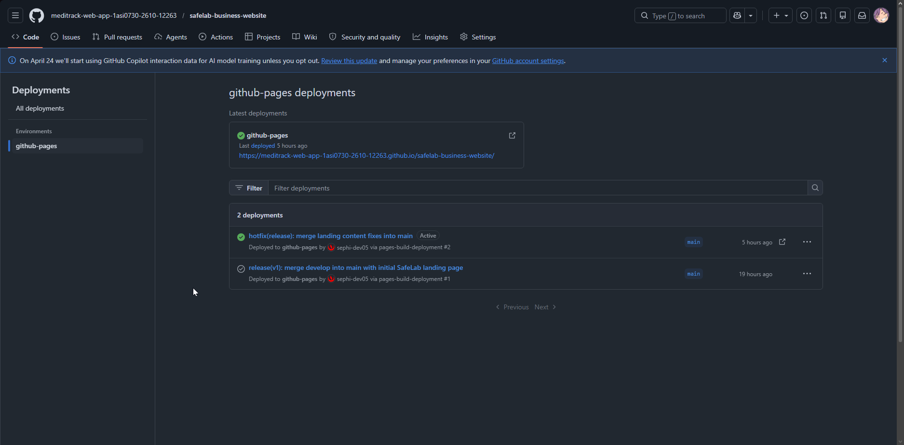

<section id="chapter-v">
  <h1>Chapter V: Product Implementation, Validation &amp; Deployment</h1>

  <section id="configuration-management-software">
    <h2>5.1. Configuration Management Software</h2>

  This section describes the configuration management decisions adopted during the development of the Meditrack product, developed by the SafeLab startup. These decisions cover the development environment, version control, coding conventions, and deployment strategies, with the goal of ensuring consistency, maintainability, and traceability throughout the entire project lifecycle.

<section id="software-development-environment-configuration">
  <h3>5.1.1. Software Development Environment Configuration</h3>

  

    For the project development environment, tools oriented toward modern web development were considered. The team configured the necessary resources to work on the landing page and prepare the future implementation of the main application.
  

  

    The development environment includes the use of Visual Studio Code as the code editor, Git for version control, GitHub as the remote repository, and web technologies such as HTML, CSS, and JavaScript for the landing page. Additionally, the future use of frontend and backend technologies for the main application is considered, although at this initial stage, their implementation has not yet begun.
  

  

    Trello was also used as a task management tool, allowing work to be divided into lists such as Backlog, Sprint Backlog, To Do, In Process, and Done. Team communication was carried out through Discord for general coordination and WhatsApp for quick messages, alerts, and immediate follow-up.
  

</section>

<section id="source-code-management">
  <h3>5.1.2. Source Code Management</h3>

 

    The source code management of the Meditrack project was carried out using Git as the version control system
    and GitHub as the remote repository. These tools allowed maintaining traceability of changes, distributed
    version control, and collaboration among team members.
  

  

    The project has multiple repositories organized according to the type of deliverable. On one hand, there is a
    repository dedicated to the technical report, where project documentation is stored. On the other hand, there
    is an independent repository for the landing page, where the source code of the deployed web application is managed.
  

  <ul>
    <li>
      General project repository:
       
      <a href="https://github.com/meditrack-web-app-1asi0730-2610-12263" target="_blank">
        https://github.com/meditrack-web-app-1asi0730-2610-12263
      </a>
    </li>

<li>
  Report repository:
   
  <a href="https://github.com/meditrack-web-app-1asi0730-2610-12263/safelab-report.git" target="_blank">
    https://github.com/meditrack-web-app-1asi0730-2610-12263/safelab-report.git
  </a>
</li>

<li>
  Landing page repository:
   
  <a href="https://github.com/meditrack-web-app-1asi0730-2610-12263/safelab-business-website.git" target="_blank">
    https://github.com/meditrack-web-app-1asi0730-2610-12263/safelab-business-website.git
  </a>
</li>
  </ul>

During development, a basic commit strategy focused on documenting project progress was used. Commits were structured using prefixes such as <strong>docs</strong>, <strong>feat</strong>,
<strong>chore</strong>, and <strong>deploy</strong>, allowing identification of the type of change made in each repository update.

At this stage of the project, commits mainly focused on repository creation, initial environment setup, landing page development, and progress on report documentation. There are still no commits related to frontend or backend development of the main application, as these phases will be addressed in later sprints.

This organization allowed maintaining a clear separation between the different components of the project, facilitating code management, change review, and future system scalability.

</section>

<section id="source-code-style-guide-conventions">
  <h3>5.1.3. Source Code Style Guide &amp; Conventions</h3>
  

    In order to ensure consistency, maintainability, and quality in the development of the Meditrack project,
    coding conventions were established for all technologies used, including HTML, CSS, JavaScript, Vue.js, C#, and Gherkin. All naming conventions follow the English language and recognized industry standards.
  

<h4>HTML and CSS</h4>

  
<strong>Standards:</strong>

  <ul>
    <li>Based on W3C recommendations and Google Style Guide</li>
    <li>Indentation: 2 spaces</li>
    <li>Use of double quotes for HTML attributes</li>
    <li>Descriptive comments in English</li>
  </ul>

  
<strong>Methodology:</strong>

  <ul>
    <li>Use of BEM (Block-Element-Modifier) for CSS classes</li>
    <li>Use of semantic HTML tags such as &lt;header&gt;, &lt;section&gt;, &lt;article&gt;</li>
  </ul>

<h4>JavaScript</h4>

  
<strong>Guidelines:</strong>

  <ul>
    <li>Based on MDN and Google JavaScript Style Guide</li>
    <li>Variables and functions in camelCase (e.g., calculateTotal)</li>
    <li>Use of const or let (avoiding var)</li>
    <li>Use of single quotes for strings ('text')</li>
    <li>Preference for arrow functions</li>
  </ul>

<h4>Vue.js</h4>

  
<strong>Conventions:</strong>

  <ul>
    <li>Components in PascalCase (e.g., UserProfile.vue)</li>
    <li>Props and methods in camelCase</li>
    <li>Use of shorthand directives (@ for v-on, : for v-bind)</li>
    <li>Component organization by feature folders</li>
    <li>Lifecycle order (created(), mounted(), etc.)</li>
  </ul>

<h4>C# (ASP.NET Core)</h4>

  
<strong>Microsoft Style:</strong>

  <ul>
    <li>Classes and methods in PascalCase (e.g., UserService)</li>
    <li>Variables and parameters in camelCase</li>
    <li>Use of XML comments (/// &lt;summary&gt;)</li>
  </ul>

  
<strong>ASP.NET Core:</strong>

  <ul>
    <li>Dependency Injection implementation</li>
    <li>Layered architecture (MVC)</li>
    <li>Use of ViewModels for data transfer</li>
  </ul>

<h4>Gherkin (.feature)</h4>

  <ul>
    <li>Use of Given – When – Then</li>
    <li>Clear, descriptive, non-technical language</li>
    <li>Reusable scenarios</li>
  </ul>

<h4>General Best Practices</h4>

  <ul>
    <li>Code modularity and reuse</li>
    <li>Readable naming conventions</li>
    <li>Consistent indentation</li>
    <li>Performance optimization</li>
    <li>Security by design</li>
  </ul>

  

    These conventions ensure a consistent, scalable, and maintainable codebase aligned with professional standards.
  

</section>

<section id="software-deployment-configuration">
  <h3>5.1.4. Software Deployment Configuration</h3>
</section>

  The steps for deploying the components currently implemented in the Meditrack solution are detailed below, which correspond to the Landing Page and the project report.

<h4>Deployment Steps</h4>

<strong>Landing Page:</strong>

<ul>
  <li>Clone or download the repository from GitHub.</li>
  <li>Install the necessary project dependencies (if applicable).</li>
  <li>Build the project if build tools are used.</li>
  <li>Publish the static files (HTML, CSS, and JavaScript) on a web server or hosting service.</li>
  <li>Verify that the page displays correctly in the browser.</li>
</ul>

  🔗 Link to the Landing Page repository:
   
  <a href="https://github.com/meditrack-web-app-1asi0730-2610-12263/safelab-business-website.git" target="_blank">
    https://github.com/meditrack-web-app-1asi0730-2610-12263/safelab-business-website.git
  </a>

  🔗 Link to the deployed Landing Page:
   
  <a href="https://meditrack-web-app-1asi0730-2610-12263.github.io/safelab-business-website/" target="_blank">
    https://meditrack-web-app-1asi0730-2610-12263.github.io/safelab-business-website/
  </a>

<strong>Project Report:</strong>

<ul>
  <li>Access the report repository on GitHub.</li>
  <li>Update the content corresponding to each chapter of the project.</li>
  <li>Verify the HTML structure and document formatting.</li>
  <li>Upload changes to the repository through commits.</li>
  <li>Validate the correct visualization of the report in the corresponding environment or viewer.</li>
</ul>

  🔗 Link to the report repository:
   
  <a href="https://github.com/meditrack-web-app-1asi0730-2610-12263/safelab-report.git" target="_blank">
    https://github.com/meditrack-web-app-1asi0730-2610-12263/safelab-report.git
  </a>

  Currently, the project deployment is limited to the Landing Page and the report documentation. The frontend and backend applications of Meditrack have not yet been implemented or deployed at this stage, and their configuration will be addressed in future sprints.

<section id="landing-page-services-applications-implementation">
  <h2>5.2. Landing Page, Services &amp; Applications Implementation</h2>

<section id="sprint-1"> 

<h3>5.2.1. Sprint 1</h3>

  

    Sprint 1 of the Meditrack project focused on the initial organization of the project, consolidation of report documentation, task management through Trello, and the development and deployment of the Landing Page. During this sprint, the team prioritized planning, coordination, and delivery of initial evidence, leaving frontend and backend development for future iterations.
  

  <section id="sprint-planning-1">
    <h4>5.2.1.1. Sprint Planning 1</h4>

  During Sprint 1 planning, the team defined the main objective as establishing the organizational and technical foundations of the Meditrack project. Tasks related to repository configuration, collaborative tools, report progress, and Landing Page implementation were prioritized.

  

    In this sprint, the focus was on project organization, report progress, and Landing Page development. Tasks were distributed among SafeLab team members, assigning specific responsibilities. In this context, Reyes Menacho, Camila Asuncion was responsible for developing Chapter V.
  

  <table>
    <tr>
      <th>Sprint 1</th>
      <th>Sprint 1</th>
    </tr>

<tr>
  <td><strong>Sprint Planning Background</strong></td>
  <td></td>
</tr>

<tr>
  <td>Date</td>
  <td>April 2026</td>
</tr>

<tr>
  <td>Time</td>
  <td>8:30 PM</td>
</tr>

<tr>
  <td>Location</td>
  <td>Via Discord</td>
</tr>

<tr>
  <td>Prepared By</td>
  <td>SafeLab Team</td>
</tr>

<tr>
  <td>Attendees (to planning meeting)</td>
  <td>
    Carlos Lavado, Augusto Montes, Jean Arizabal,
    Camila Reyes, Juan Orosco
  </td>
</tr>

<tr>
  <td>Sprint 1 Review Summary</td>
  <td>
    This sprint focused on project organization, report development, and Landing Page implementation as the first deliverable.
  </td>
</tr>

<tr>
  <td>Sprint 1 Retrospective Summary</td>
  <td>
    The team identified progress in organization and documentation, as well as improvement opportunities in planning the technical development of the main application.
  </td>
</tr>

<tr>
  <td><strong>Sprint Goal &amp; User Stories</strong></td>
  <td></td>
</tr>

<tr>
  <td>Sprint 1 Goal</td>
  <td>
    Develop and deploy a Landing Page that presents Meditrack product information, while significantly advancing the project report documentation.
  </td>
</tr>

<tr>
  <td>Sprint 1 Velocity</td>
  <td>7 story points</td>
</tr>

<tr>
  <td>Sum of Story Points</td>
  <td>7 Story Points</td>
</tr>
  </table> 
  </section>

  <section id="aspect-leaders-and-collaborators">
    <h4>5.2.1.2. Aspect Leaders and Collaborators</h4>

<table>
      <tr>
        <th>Team Member</th>
        <th>Code</th>
        <th>Aspect 1: Landing Page</th>
        <th>Aspect 2: Report</th>
      </tr>
      <tr>
        <td>Lavado, Carlos Ever Giusephi</td>
        <td>U202224867</td>
        <td>C</td>
        <td>L</td>
      </tr>
      <tr>
        <td>Montes Maza, Augusto Sebastian</td>
        <td>U202218645</td>
        <td>C</td>
        <td>L</td>
      </tr>
      <tr>
        <td>Arizabal Condori, Jean Niels</td>
        <td>U201919096</td>
        <td>C</td>
        <td>L</td>
      </tr>
      <tr>
        <td>Reyes Menacho, Camila Asuncion</td>
        <td>U201921442</td>
        <td>L</td>
        <td>L (Chapter V)</td>
      </tr>
      <tr>
        <td>Orosco Ttamiña, Juan Carlos</td>
        <td>U202414840</td>
        <td>C</td>
        <td>L</td>
      </tr>
    </table>
  </section>

  <section id="sprint-backlog-1">
    <h4>5.2.1.3. Sprint Backlog 1</h4>
     

    Sprint Backlog 1 consisted of tasks related to project organization, team communication, report progress, Landing Page development, and its deployment. These tasks were organized in Trello to track their progress status.
  

  <table>
    <thead>
      <tr>
        <th>User Story ID</th>
        <th>Title</th>
        <th>Task ID</th>
        <th>Task</th>
        <th>Description</th>
        <th>Assigned</th>
        <th>Status</th>
      </tr>
    </thead>

<tbody>
  <tr>
    <td>US01</td>
    <td>Organize project</td>
    <td>UT01</td>
    <td>Configure Trello</td>
    <td>Create lists and workflow</td>
    <td>Camila</td>
    <td>Done</td>
  </tr>

  <tr>
    <td>US02</td>
    <td>Team communication</td>
    <td>UT02</td>
    <td>Define channels</td>
    <td>Use of Discord and WhatsApp</td>
    <td>Team</td>
    <td>Done</td>
  </tr>

  <tr>
    <td>US03</td>
    <td>Report</td>
    <td>UT03</td>
    <td>Develop Chapter I</td>
    <td>Report writing</td>
    <td>Jean</td>
    <td>In Process</td>
  </tr>

  <tr>
    <td>US03</td>
    <td>Report</td>
    <td>UT04</td>
    <td>Develop Chapter II</td>
    <td>Report writing</td>
    <td>Jean</td>
    <td>In Process</td>
  </tr>

  <tr>
    <td>US03</td>
    <td>Report</td>
    <td>UT05</td>
    <td>Develop Chapter III</td>
    <td>Report writing</td>
    <td>Juan</td>
    <td>In Process</td>
  </tr>

  <tr>
    <td>US03</td>
    <td>Report</td>
    <td>UT06</td>
    <td>Develop Chapter IV</td>
    <td>Report writing</td>
    <td>Giusephi and Sebastian</td>
    <td>In Process</td>
  </tr>

  <tr>
    <td>US04</td>
    <td>Report</td>
    <td>UT07</td>
    <td>Develop Chapter V</td>
    <td>Configuration, deployment, and evidence</td>
    <td>Camila</td>
    <td>In Process</td>
  </tr>

  <tr>
    <td>US05</td>
    <td>Landing Page</td>
    <td>UT08</td>
    <td>Develop landing</td>
    <td>Visual implementation of the product</td>
    <td>Team</td>
    <td>Done</td>
  </tr>

  <tr>
    <td>US06</td>
    <td>Deploy</td>
    <td>UT09</td>
    <td>Deploy landing</td>
    <td>Web publication</td>
    <td>Giusephi</td>
    <td>Done</td>
  </tr>
</tbody>
  </table>
</section>

<section id="development-evidence-for-sprint-review">
  <h4>5.2.1.4. Development Evidence for Sprint Review</h4>

This section presents the commits that provide evidence of the Landing Page development of the Meditrack project, including integration, content fixes, styling, and deployment.

🔗 Landing Page repository:
 
<a href="https://github.com/meditrack-web-app-1asi0730-2610-12263/safelab-business-website.git" target="_blank">
View repository
</a>

<table>
<tr>
<th>Repository</th>
<th>Branch</th>
<th>Commit Id</th>
<th>Commit Message</th>
<th>Committed on</th>
</tr>

<tr>
<td>safelab-business-website</td>
<td>main</td>
<td>6144d89</td>
<td>hotfix(release): merge landing content fixes into main</td>
<td>2026-04-23</td>
</tr>

<tr>
<td>safelab-business-website</td>
<td>main</td>
<td>99070d</td>
<td>release(v1): merge develop into main with initial SafeLab landing page</td>
<td>2026-04-23</td>
</tr>

<tr>
<td>safelab-business-website</td>
<td>develop</td>
<td>4b6dd01</td>
<td>merge(safelab-landing): integrate initial landing page, styles</td>
<td>2026-04-23</td>
</tr>

<tr>
<td>safelab-business-website</td>
<td>hotfix/landing-content</td>
<td>190222a</td>
<td>fix(styles): enhance team section with updated avatar styles</td>
<td>2026-04-24</td>
</tr>

<tr>
<td>safelab-business-website</td>
<td>hotfix/landing-content</td>
<td>ec8e452</td>
<td>fix(content): update image paths and team section content</td>
<td>2026-04-24</td>
</tr>

<tr>
<td>safelab-business-website</td>
<td>hotfix/landing-content</td>
<td>6f44d89</td>
<td>fix(assets): update SafeLab branding logos and images</td>
<td>2026-04-24</td>
</tr>

<tr>
<td>safelab-business-website</td>
<td>develop</td>
<td>2c37fd7</td>
<td>chore(merge): sync develop with main</td>
<td>2026-04-24</td>
</tr>

<tr>
<td>safelab-business-website</td>
<td>feature/i18n-language-switcher</td>
<td>a3efc69</td>
<td>feat: implement language switcher feature</td>
<td>2026-04-24</td>
</tr>

</table>
</section>

<section id="execution-evidence-for-sprint-review">
  <h4>5.2.1.5. Execution Evidence for Sprint Review</h4>

  During the sprint, the Landing Page functionalities were completed. The execution evidence is shown through access to the deployed system.

  🔗 Deployed Landing Page:
   
  <a href="https://meditrack-web-app-1asi0730-2610-12263.github.io/safelab-business-website/" target="_blank">
    View Landing Page
  </a>

</section>

<section id="services-documentation-evidence-for-sprint-review">
  <h4>5.2.1.6. Services Documentation Evidence for Sprint Review</h4>

  As defined in sprint planning, this sprint focused only on the Landing Page development and report progress.

  No backend services or OpenAPI-documented endpoints were implemented, since the main application development is planned for future sprints.

</section>

<section id="software-deployment-evidence-for-sprint-review">
  <h4>5.2.1.7. Software Deployment Evidence for Sprint Review</h4>

  During this sprint, the Landing Page was deployed as the first evidence of the Meditrack product. The goal was to provide an online accessible version for initial validation.

  Activities performed:

<ul>
  <li>Creation of the GitHub repository</li>
  <li>Upload of Landing Page source code</li>
  <li>Deployment environment configuration</li>
  <li>Public access verification</li>
</ul>

  🔗 Deployed Landing Page:
   
  <a href="https://meditrack-web-app-1asi0730-2610-12263.github.io/safelab-business-website/" target="_blank">
    View Landing Page
  </a>

  🔗 Report repository:
   
  <a href="https://github.com/meditrack-web-app-1asi0730-2610-12263/safelab-report.git" target="_blank">
    View repository
  </a>

  
  
Figure X. Landing Page deployment evidence

</section>

<section id="team-collaboration-insights-during-sprint">
  <h4>5.2.1.8. Team Collaboration Insights during Sprint</h4>

  During Sprint 1, the SafeLab team worked collaboratively through task and report chapter distribution.

  Task management was carried out using Trello, allowing visualization of progress through lists such as Backlog, Sprint Backlog, To Do, In Process, and Done.

  Team communication was conducted via Discord for meetings and general coordination, and WhatsApp for quick communication and follow-up.

  Reyes Menacho, Camila Asuncion was responsible for developing Chapter V, consolidating implementation, deployment, and sprint evidence documentation.

<figure style="text-align: center;">
  
  <figcaption>Figure 5.1. Trello board evidence used in Sprint 1</figcaption>
</figure>

  🔗 Trello Board:
   
  <a href="https://trello.com/b/rTOXeOxY/trabajo-final-de-aplicaciones-web" target="_blank">
    View board
  </a>

</section>

<section id="validation-interviews">
  <h2>5.3. Validation Interviews</h2>

<section id="interview-design">
  <h3>5.3.1. Interview Design</h3>
</section>

<section id="interview-recording">
  <h3>5.3.2. Interview Recording</h3>
</section>

<section id="evaluations-based-on-heuristics">
  <h3>5.3.3. Evaluations Based on Heuristics</h3>
</section>
</section>

<section id="about-the-product-video">
  <h2>5.4. About-the-Product Video</h2>
</section>
</section>