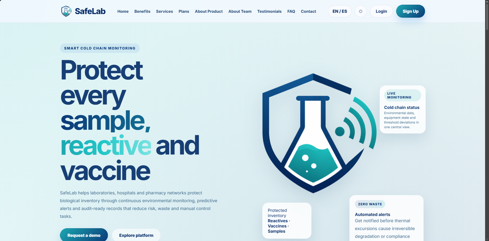
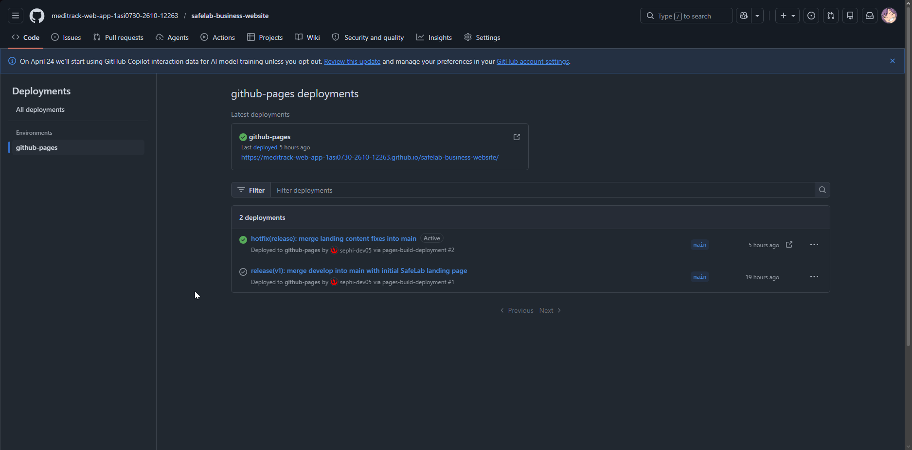
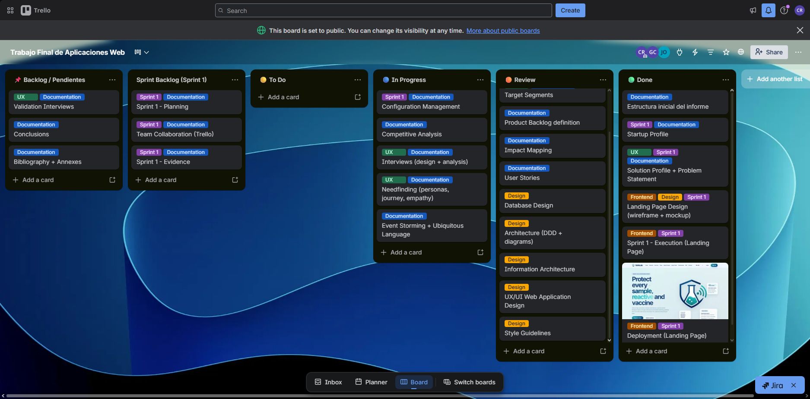

# **Chapter V: Product Implementation, Validation &amp; Deployment**
## **5.1. Configuration Management Software**

  This section describes the configuration management decisions adopted during the development of the Meditrack product, developed by the SafeLab startup. These decisions cover the development environment, version control, coding conventions, and deployment strategies, with the goal of ensuring consistency, maintainability, and traceability throughout the entire project lifecycle.

### **5.1.1. Software Development Environment Configuration**

  For the project development environment, tools oriented toward modern web development were considered. The team configured the necessary resources to work on the landing page and prepare the future implementation of the main application.

  The development environment includes the use of Visual Studio Code as the code editor, Git for version control, GitHub as the remote repository, and web technologies such as HTML, CSS, and JavaScript for the landing page. Additionally, the future use of frontend and backend technologies for the main application is considered, although at this initial stage, their implementation has not yet begun.

  Trello was also used as a task management tool, allowing work to be divided into lists such as Backlog, Sprint Backlog, To Do, In Process, and Done. Team communication was carried out through Discord for general coordination and WhatsApp for quick messages, alerts, and immediate follow-up.

### **5.1.2. Source Code Management**

  The source code management of the Meditrack project was carried out using Git as the version control system and GitHub as the remote repository. These tools allowed maintaining traceability of changes, distributed version control, and collaboration among team members.

  The project has multiple repositories organized according to the type of deliverable. On one hand, there is a repository dedicated to the technical report, where project documentation is stored. On the other hand, there is an independent repository for the landing page, where the source code of the deployed web application is managed.

<ul>
  <li>
    <a href="https://github.com/meditrack-web-app-1asi0730-2610-12263" target="_blank">
      General Project Repository
    </a>
  </li>
  <li>
    <a href="https://github.com/meditrack-web-app-1asi0730-2610-12263/safelab-report.git" target="_blank">
      Report Repository:
    </a>
  </li>
  <li>
    <a href="https://github.com/meditrack-web-app-1asi0730-2610-12263/safelab-business-website.git" target="_blank">
      Landing page Repository
    </a>
  </li>
</ul>

  During development, a basic commit strategy focused on documenting project progress was used. Commits were structured using prefixes such as <b>docs</b>, <b>feat</b>, <b>chore</b>, and <b>deploy</b>, allowing identification of the type of change made in each repository update.

  At this stage of the project, commits mainly focused on repository creation, initial environment setup, landing page development, and progress on report documentation. There are still no commits related to frontend or backend development of the main application, as these phases will be addressed in later sprints.

  This organization allowed maintaining a clear separation between the different components of the project, facilitating code management, change review, and future system scalability.

### **5.1.3. Source Code Style Guide & Conventions**

  In order to ensure consistency, maintainability, and quality in the development of the Meditrack project, coding conventions were established for all technologies used, including HTML, CSS, JavaScript, Vue.js, C#, and Gherkin. All naming conventions follow the English language and recognized industry standards.

<ul>
  <li>
    <b>HTML and CSS</b>
    <ul>
      <li>
        <b>Standards:</b>
        <ul>
          <li>
            Based on W3C recommendations and Google Style Guide
          </li>
          <li>
            Indentation: 2 spaces
          </li>
          <li>
            Use of double quotes for HTML attributes
          </li>
          <li>
            Descriptive comments in English
          </li>
        </ul>
      </li>
      <li>
        <b>Methodology:</b>
        <ul>
          <li>
            Use of BEM (Block-Element-Modifier) for CSS classes
          </li>
          <li>
            Use of semantic HTML tags such as &lt;header&gt;, &lt;section&gt;, &lt;article&gt;
          </li>
        </ul>
      </li>
    </ul>
  </li>
  <li>
    <b>JavaScript</b>
    <ul>
      <li>
        <b>Guidelines:</b>
        <ul>
          <li>
            Based on MDN and Google JavaScript Style Guide
          </li>
          <li>
            Variables and functions in camelCase (e.g., calculateTotal)
          </li>
          <li>
            Use of const or let (avoiding var)
          </li>
          <li>
            Use of single quotes for strings ('text')
          </li>
          <li>
            Preference for arrow functions
          </li>
        </ul>
      </li>
    </ul>
  </li>
  

  <li>
    <b>Vue.js</b>
    <ul>
      <li>
        <b>Conventions:</b>
        <ul>
          <li>
            Components in PascalCase (e.g., UserProfile.vue)
          </li>
          <li>
            Props and methods in camelCase
          </li>
          <li>
            Use of shorthand directives (@ for v-on, : for v-bind)
          </li>
          <li>
            Component organization by feature folders
          </li>
          <li>
            Lifecycle order (created(), mounted(), etc.)
          </li>
        </ul>
      </li>
    </ul>
  </li>
  <li>
    <b>C# (ASP.NET Core)</b>
    <ul>
      <li>
        <b>Microsoft Style:</b>
        <ul>
          <li>
            Classes and methods in PascalCase (e.g., UserService)
          </li>
          <li>
            Variables and parameters in camelCase
          </li>
          <li>
            Use of XML comments (/// &lt;summary&gt;)
          </li>
        </ul>
      </li>
      <li>
        <b>ASP.NET Core:</b>
        <ul>
          <li>
            Dependency Injection implementation
          </li>
          <li>
            Layered architecture (MVC)
          </li>
          <li>
            Use of ViewModels for data transfer
          </li>
        </ul>
      </li>
    </ul>
  </li>
  <li>
    <b>Gherkin (.feature)</b>
    <ul>
      <li>
        Use of Given – When – Then
      </li>
      <li>
        Clear, descriptive, non-technical language
      </li>
      <li>
        Reusable scenarios
      </li>
    </ul>
  </li>
  <li>
    <b>General Best Practices</b>
    <ul>
      <li>
        Code modularity and reuse
      </li>
      <li>
        Readable naming conventions
      </li>
      <li>
        Consistent indentation
      </li>
      <li>
        Performance optimization
      </li>
      <li>
        Security by design
      </li>
    </ul>
  </li>
</ul>

  These conventions ensure a consistent, scalable, and maintainable codebase aligned with professional standards.

### **5.1.4. Software Deployment Configuration**

  The steps for deploying the components currently implemented in the Meditrack solution are detailed below, which correspond to the Landing Page and the project report.

Deployment Steps

<ul>
  <li>
    <b>Landing Page:</b>
    <ul>
      <li>
        Clone or download the repository from GitHub.
      </li>
      <li>
        Install the necessary project dependencies (if applicable).
      </li>
      <li>
        Build the project if build tools are used.
      </li>
      <li>
        Publish the static files (HTML, CSS, and JavaScript) on a web server or hosting service.
      </li>
      <li>
        Verify that the page displays correctly in the browser.
      </li>
    </ul>
  </li>
</ul>

> [**Landing Page Repository**](https://github.com/meditrack-web-app-1asi0730-2610-12263/safelab-business-website.git)

> [**Deployed Landing Page**](https://meditrack-web-app-1asi0730-2610-12263.github.io/safelab-business-website/)

<ul>
  <li>
    <b>Project Report:</b>
    <ul>
      <li>
        Access the report repository on GitHub.
      </li>
      <li>
        Update the content corresponding to each chapter of the project.
      </li>
      <li>
        Verify the HTML structure and document formatting.
      </li>
      <li>
        Upload changes to the repository through commits.
      </li>
      <li>
        Validate the correct visualization of the report in the corresponding environment or viewer.
      </li>
    </ul>
  </li>
</ul>

> [**Report Repository**](https://github.com/meditrack-web-app-1asi0730-2610-12263/safelab-report.git)

  Currently, the project deployment is limited to the Landing Page and the report documentation. The frontend and backend applications of Meditrack have not yet been implemented or deployed at this stage, and their configuration will be addressed in future sprints.

## **5.2. Landing Page, Services &amp; Applications Implementation**
### **5.2.1. Sprint 1**

  Sprint 1 of the Meditrack project focused on the initial organization of the project, consolidation of report documentation, task management through Trello, and the development and deployment of the Landing Page. During this sprint, the team prioritized planning, coordination, and delivery of initial evidence, leaving frontend and backend development for future iterations.

#### **5.2.1.1. Sprint Planning 1**

  During Sprint 1 planning, the team defined the main objective as establishing the organizational and technical foundations of the Meditrack project. Tasks related to repository configuration, collaborative tools, report progress, and Landing Page implementation were prioritized.

  In this sprint, the focus was on project organization, report progress, and Landing Page development. Tasks were distributed among SafeLab team members, assigning specific responsibilities. In this context, Reyes Menacho, Camila Asuncion was responsible for developing Chapter V.

<table style="margin: auto; table-layout: fixed; width: 80%;">
  <tr style="background-color: #d9d9d9;">
    <td>
      <b>Sprint #</b>
    </td>
    <td style="text-align: center;">
      1
    </td>
  </tr>
  <tr>
    <td style="text-align: center;" colspan="2">
      <b>Sprint Planning Background</b>
    </td>
  </tr>
  <tr>
    <td>
      <b>Date</b>
    </td>
    <td>
      April 2026
    </td>
  </tr>
  <tr>
    <td>
      <b>Time</b>
    </td>
    <td>
      8:30 PM
    </td>
  </tr>
  <tr>
    <td>
      <b>Location</b>
    </td>
    <td>
      Via Discord
    </td>
  </tr>
  <tr>
    <td>
      <b>Prepared By</b>
    </td>
    <td>
      SafeLab Team
    </td>
  </tr>
  <tr>
    <td>
      <b>Attendees (to planning meeting)</b>
    </td>
    <td>
      Carlos Lavado, Augusto Montes, Jean Arizabal, Camila Reyes, Juan Orosco
    </td>
  </tr>
  <tr>
    <td>
      <b>Sprint 1 Review Summary</b>
    </td>
    <td style="text-align: justify;">
      This sprint focused on project organization, report development, and Landing Page implementation as the first deliverable.
    </td>
  </tr>
  <tr>
    <td>
      <b>Sprint 1 Retrospective Summary</b>
    </td>
    <td style="text-align: justify;">
      The team identified progress in organization and documentation, as well as improvement opportunities in planning the technical development of the main application.
    </td>
  </tr>
  <tr>
    <td style="text-align: center;" colspan="2">
      <b>Sprint Goal &amp; User Stories</b>
    </td>
  </tr>
  <tr>
    <td>
      <b>Sprint 1 Goal</b>
    </td>
    <td style="text-align: justify;">
      Develop and deploy a Landing Page that presents Meditrack product information, while significantly advancing the project report documentation.
    </td>
  </tr>
  <tr>
    <td>
      <b>Sprint 1 Velocity</b>
    </td>
    <td>
      7 story points
    </td>
  </tr>
  <tr>
    <td>
      <b>Sum of Story Points</b>
    </td>
    <td>
      7 Story Points
    </td>
  </tr>
</table>

#### **5.2.1.2. Aspect Leaders and Collaborators**

<table>
  <thead>
    <tr>
      <th style="text-align: center;">
        Team Member
      </th>
      <th style="text-align: center;">
        Code
      </th>
      <th style="text-align: center;">
        Aspect 1: Landing Page
      </th>
      <th style="text-align: center;">
        Aspect 2: Report
      </th>
    </tr>
  </thead>
  <tbody>
    <tr>
      <td style="text-align: center;">
        Carlos Lavado, Ever Giusephi
      </td>
      <td style="text-align: center;">
        U202224867
      </td>
      <td style="text-align: center;">
        C
      </td>
      <td style="text-align: center;">
        L
      </td>
    </tr>
    <tr>
      <td style="text-align: center;">
        Montes Maza, Augusto Sebastian
      </td>
      <td style="text-align: center;">
        U202218645
      </td>
      <td style="text-align: center;">
        C
      </td>
      <td style="text-align: center;">
        L
      </td>
    </tr>
    <tr>
      <td style="text-align: center;">
        Arizabal Condori, Jean Niels
      </td>
      <td style="text-align: center;">
        U201919096
      </td>
      <td style="text-align: center;">
        C
      </td>
      <td style="text-align: center;">
        L
      </td>
    </tr>
    <tr>
      <td style="text-align: center;">
        Reyes Menacho, Camila Asuncion
      </td>
      <td style="text-align: center;">
        U201921442
      </td>
      <td style="text-align: center;">
        L
      </td>
      <td style="text-align: center;">
        L (Chapter V)
      </td>
    </tr>
    <tr>
      <td style="text-align: center;">
        Orosco Ttamiña, Juan Carlos
      </td>
      <td style="text-align: center;">
        U202414840
      </td>
      <td style="text-align: center;">
        C
      </td>
      <td style="text-align: center;">
        L
      </td>
    </tr>
  </tbody>
</table>

#### **5.2.1.3. Sprint Backlog 1**

  Sprint Backlog 1 consisted of tasks related to project organization, team communication, report progress, Landing Page development, and its deployment. These tasks were organized in Trello to track their progress status.

<table style="margin: auto;">
  <thead>
    <tr>
      <th style="text-align: center;">
        User Story ID
      </th>
      <th style="text-align: center;">
        Title
      </th>
      <th style="text-align: center;">
        Task ID
      </th>
      <th style="text-align: center;">
        Task
      </th>
      <th style="text-align: center;">
        Description
      </th>
      <th style="text-align: center;">
        Assigned
      </th>
      <th style="text-align: center;">
        Status
      </th>
    </tr>
  </thead>
  <tbody>
    <tr>
      <td style="text-align: center;">
        US01
      </td>
      <td style="text-align: center;">
        Organize project
      </td>
      <td style="text-align: center;">
        UT01
      </td>
      <td style="text-align: center;">
        Configure Trello
      </td>
      <td style="text-align: justify;">
        Create lists and workflow
      </td>
      <td style="text-align: center;">
        Camila
      </td>
      <td style="text-align: center;">
        Done
      </td>
    </tr>
    <tr>
      <td style="text-align: center;">
        US02
      </td>
      <td style="text-align: center;">
        Team communication
      </td>
      <td style="text-align: center;">
        UT02
      </td>
      <td style="text-align: center;">
        Define channels
      </td>
      <td style="text-align: justify;">
        Use of Discord and WhatsApp
      </td>
      <td style="text-align: center;">
        Team
      </td>
      <td style="text-align: center;">
        Done
      </td>
    </tr>
    <tr>
      <td style="text-align: center;">
        US03
      </td>
      <td style="text-align: center;">
        Report
      </td>
      <td style="text-align: center;">
        UT03
      </td>
      <td style="text-align: center;">
        Develop Chapter I
      </td>
      <td style="text-align: justify;">
        Report writing
      </td>
      <td style="text-align: center;">
        Jean
      </td>
      <td style="text-align: center;">
        In Process
      </td>
    </tr>
    <tr>
      <td style="text-align: center;">
        US03
      </td>
      <td style="text-align: center;">
        Report
      </td>
      <td style="text-align: center;">
        UT04
      </td>
      <td style="text-align: center;">
        Develop Chapter II
      </td>
      <td style="text-align: justify;">
        Report writing
      </td>
      <td style="text-align: center;">
        Jean
      </td>
      <td style="text-align: center;">
        In Process
      </td>
    </tr>
    <tr>
      <td style="text-align: center;">
        US03
      </td>
      <td style="text-align: center;">
        Report
      </td>
      <td style="text-align: center;">
        UT05
      </td>
      <td style="text-align: center;">
        Develop Chapter III
      </td>
      <td style="text-align: justify;">
        Report writing
      </td>
      <td style="text-align: center;">
        Juan
      </td>
      <td style="text-align: center;">
        In Process
      </td>
    </tr>
    <tr>
      <td style="text-align: center;">
        US03
      </td>
      <td style="text-align: center;">
        Report
      </td>
      <td style="text-align: center;">
        UT06
      </td>
      <td style="text-align: center;">
        Develop Chapter IV
      </td>
      <td style="text-align: justify;">
        Report writing
      </td>
      <td style="text-align: center;">
        Giusephi and Sebastian
      </td>
      <td style="text-align: center;">
        In Process
      </td>
    </tr>
    <tr>
      <td style="text-align: center;">
        US04
      </td>
      <td style="text-align: center;">
        Report
      </td>
      <td style="text-align: center;">
        UT07
      </td>
      <td style="text-align: center;">
        Develop Chapter V
      </td>
      <td style="text-align: justify;">
        Configuration, deployment, and evidence
      </td>
      <td style="text-align: center;">
        Camila
      </td>
      <td style="text-align: center;">
        In Process
      </td>
    </tr>
    <tr>
      <td style="text-align: center;">
        US05
      </td>
      <td style="text-align: center;">
        Landing Page
      </td>
      <td style="text-align: center;">
        UT08
      </td>
      <td style="text-align: center;">
        Develop landing
      </td>
      <td style="text-align: justify;">
        Visual implementation of the product
      </td>
      <td style="text-align: center;">
        Team
      </td>
      <td style="text-align: center;">
        Done
      </td>
    </tr>
    <tr>
      <td style="text-align: center;">
        US06
      </td>
      <td style="text-align: center;">
        Deploy
      </td>
      <td style="text-align: center;">
        UT09
      </td>
      <td style="text-align: center;">
        Deploy landing
      </td>
      <td style="text-align: justify;">
        Web publication
      </td>
      <td style="text-align: center;">
        Giusephi
      </td>
      <td style="text-align: center;">
        Done
      </td>
    </tr>
  </tbody>
</table>

#### **5.2.1.4. Development Evidence for Sprint Review**

  This section presents the commits that provide evidence of the Landing Page development of the Meditrack project, including integration, content fixes, styling, and deployment.

> [**Landing Page Repository**](https://github.com/meditrack-web-app-1asi0730-2610-12263/safelab-business-website.git)

<table style="margin: auto;">
  <tr>
    <th style="text-align: center;">
      Repository
    </th>
    <th style="text-align: center;">
      Branch
    </th>
    <th style="text-align: center;">
      Commit Id
    </th>
    <th style="text-align: center;">
      Commit Message
    </th>
    <th style="text-align: center;">
      Committed on
    </th>
  </tr>
  <tr>
    <td style="text-align: center;">
      safelab-business-website
    </td>
    <td style="text-align: center;">
      main
    </td>
    <td style="text-align: center;">
      6144d89
    </td>
    <td style="text-align: justify;">
      hotfix(release): merge landing content fixes into main
    </td>
    <td style="text-align: center;">
      2026-04-23
    </td>
  </tr>
  <tr>
    <td style="text-align: center;">
      safelab-business-website
    </td>
    <td style="text-align: center;">
      main
    </td>
    <td style="text-align: center;">
      99070d
    </td>
    <td style="text-align: justify;">
      release(v1): merge develop into main with initial SafeLab landing page
    </td>
    <td style="text-align: center;">
      2026-04-23
    </td>
  </tr>
  <tr>
    <td style="text-align: center;">
      safelab-business-website
    </td>
    <td style="text-align: center;">
      develop
    </td>
    <td style="text-align: center;">
      4b6dd01
    </td>
    <td style="text-align: justify;">
      merge(safelab-landing): integrate initial landing page, styles
    </td>
    <td style="text-align: center;">
      2026-04-23
    </td>
  </tr>
    <tr>
    <td style="text-align: center;">
      safelab-business-website
    </td>
    <td style="text-align: center;">
      hotfix/landing-content
    </td>
    <td style="text-align: center;">
      190222a
    </td>
    <td style="text-align: justify;">
      fix(styles): enhance team section with updated avatar styles
    </td>
    <td style="text-align: center;">
      2026-04-24
    </td>
  </tr>
  <tr>
    <td style="text-align: center;">
      safelab-business-website
    </td>
    <td style="text-align: center;">
      hotfix/landing-content
    </td>
    <td style="text-align: center;">
      ec8e452
    </td>
    <td style="text-align: justify;">
      fix(content): update image paths and team section content
    </td>
    <td style="text-align: center;">
      2026-04-24
    </td>
  </tr>
  <tr>
    <td style="text-align: center;">
      safelab-business-website
    </td>
    <td style="text-align: center;">
      hotfix/landing-content
    </td>
    <td style="text-align: center;">
      6f44d89
    </td>
    <td style="text-align: justify;">
      fix(assets): update SafeLab branding logos and images
    </td>
    <td style="text-align: center;">
      2026-04-24
    </td>
  </tr>
  <tr>
    <td style="text-align: center;">
      safelab-business-website
    </td>
    <td style="text-align: center;">
      develop
    </td>
    <td style="text-align: center;">
      2c37fd7
    </td>
    <td style="text-align: justify;">
      chore(merge): sync develop with main
    </td>
    <td style="text-align: center;">
      2026-04-24
    </td>
  </tr>
  <tr>
    <td style="text-align: center;">
      safelab-business-website
    </td>
    <td style="text-align: center;">
      feature/i18n-language-switcher
    </td>
    <td style="text-align: center;">
      a3efc69
    </td>
    <td style="text-align: justify;">
      feat: implement language switcher feature
    </td>
    <td style="text-align: center;">
      2026-04-24
    </td>
  </tr>
</table>

#### **5.2.1.5. Execution Evidence for Sprint Review**

  During the sprint, the Landing Page functionalities were completed. The execution evidence is shown through access to the deployed system.

  

> [**View Landing Page**](https://meditrack-web-app-1asi0730-2610-12263.github.io/safelab-business-website/)

#### **5.2.1.6. Services Documentation Evidence for Sprint Review**

  As defined in sprint planning, this sprint focused only on the Landing Page development and report progress.

  No backend services or OpenAPI-documented endpoints were implemented, since the main application development is planned for future sprints.

#### **5.2.1.7. Software Deployment Evidence for Sprint Review**

  During this sprint, the Landing Page was deployed as the first evidence of the Meditrack product. The goal was to provide an online accessible version for initial validation.

<ul>
  <li>
    <b>Activities performed:</b>
    <ul>
      <li>
        Creation of the GitHub repository
      </li>
      <li>
        Upload of Landing Page source code
      </li>
      <li>
        Deployment environment configuration
      </li>
      <li>
        Public access verification
      </li>
    </ul>
  </li>
</ul>

> [**Deployed Landing Page**](https://meditrack-web-app-1asi0730-2610-12263.github.io/safelab-business-website/)

> [**Report repository**](https://github.com/meditrack-web-app-1asi0730-2610-12263/safelab-report.git)

  
  
  

    Figure X. Landing Page deployment evidence
  

#### **5.2.1.8. Team Collaboration Insights during Sprint**

  During Sprint 1, the SafeLab team worked collaboratively through task and report chapter distribution.

  Task management was carried out using Trello, allowing visualization of progress through lists such as Backlog, Sprint Backlog, To Do, In Process, and Done.

  Team communication was conducted via Discord for meetings and general coordination, and WhatsApp for quick communication and follow-up.

  Reyes Menacho, Camila Asuncion was responsible for developing Chapter V, consolidating implementation, deployment, and sprint evidence documentation.

  

  

    Figure 5.1. Trello board evidence used in Sprint 1
  

> [**Trello Board**](https://trello.com/b/rTOXeOxY/trabajo-final-de-aplicaciones-web)

<h3>5.2.2. Sprint 2</h3>

<h4>5.2.2.1. Sprint Planning 2</h4>

  For this second sprint, the team focused on the development of the frontend web application for Meditrack.
  The sprint was carried out from April 30 to May 13. During this period, the team implemented the main
  bounded contexts of the system, including authentication, user profiles, billing, dashboards, asset monitoring,
  sensor monitoring, environmental compliance, alerts, remote control, reports, incident management and audit
  traceability. In addition, corrections were made to the final report in order to keep the documentation aligned
  with the current product implementation.

<table border="1" style="width: 100%; border-collapse: collapse;">
  <tr>
    <th colspan="5">Sprint 2</th>
    <th colspan="9">Sprint 2</th>
  </tr>
  <tr>
    <td colspan="14"><strong>Sprint Planning Background</strong></td>
  </tr>
  <tr>
    <td colspan="5">Date</td>
    <td colspan="9">2026-04-30</td>
  </tr>
  <tr>
    <td colspan="5">Time</td>
    <td colspan="9">8:30 PM</td>
  </tr>
  <tr>
    <td colspan="5">Location</td>
    <td colspan="9">Via Discord</td>
  </tr>
  <tr>
    <td colspan="5">Prepared By</td>
    <td colspan="9">Camila Asunción Reyes Menacho</td>
  </tr>
  <tr>
    <td colspan="5">Attendees to Planning Meeting</td>
    <td colspan="9">
      Ever Giusephi Carlos Lavado, Augusto Sebastian Montes Maza, Jean Niels Arizabal Condori,
      Camila Asunción Reyes Menacho and Juan Carlos Orozco Tamiña
    </td>
  </tr>
  <tr>
    <td colspan="5">Sprint 2 Review Summary</td>
    <td colspan="9">
      During Sprint 2, the team developed the frontend web application for Meditrack. The work included
      the implementation of the following sections: Identity & Access Management, User Profiles,
      Subscription & Billing, Dashboard & Overview, Asset & Inventory Monitoring, Sensor Monitoring,
      Environmental Compliance, Alerts & Notifications, Remote Control & Actuation, Reports & Analytics,
      Incident Management and Audit & Traceability. Report corrections were also completed to improve
      consistency, structure and evidence presentation.
    </td>
  </tr>
  <tr>
    <td colspan="5">Sprint 2 Retrospective Summary</td>
    <td colspan="9">
      The team improved its task distribution by assigning specific frontend modules to each member.
      This allowed parallel development and better control over each bounded context. As an improvement
      point, the team agreed to review integrations more frequently, especially routing, shared components,
      i18n files and navigation items, in order to reduce inconsistencies when merging individual contributions.
    </td>
  </tr>
  <tr>
    <td colspan="14"><strong>Sprint Goal & User Stories</strong></td>
  </tr>
  <tr>
    <td colspan="5">Sprint 2 Goal</td>
    <td colspan="9">
      Develop the first functional version of the Meditrack frontend web application using Vue 3, Vite,
      PrimeVue, Vue Router, Vue i18n and a domain-driven frontend structure. The sprint goal was to allow
      users to navigate through the main modules of the system, visualize operational information and validate
      core workflows related to monitoring, alerts, reporting, incidents, traceability and device management.
    </td>
  </tr>
  <tr>
    <td colspan="5">Sprint 2 Velocity</td>
    <td colspan="9">24 story points</td>
  </tr>
  <tr>
    <td colspan="5">Sum of Story Points</td>
    <td colspan="9">24 story points</td>
  </tr>
</table>

<h4>5.2.2.2. Aspect Leaders and Collaborators</h4>

  To improve collaboration and accountability, each team member was assigned as leader of specific frontend
  sections. Each leader was responsible for implementing the assigned bounded contexts, maintaining consistency
  with the project architecture and collaborating with the rest of the team during integration and report corrections.

<table border="1" style="width: 100%; border-collapse: collapse;">
  <tr>
    <th>Team Member</th>
    <th>GitHub Username</th>
    <th>Evidence from Commits</th>
    <th>Main Contribution</th>
  </tr>
  <tr>
    <td>Camila Asunción Reyes Menacho</td>
    <td>@dakuma-ai</td>
    <td>Multiple commits authored by Camila Reyes on 12/05/2026</td>
    <td>Alerts & Notifications; Incident Management; Report Corrections</td>
  </tr>
  <tr>
    <td>Ever Giusephi Carlos Lavado</td>
    <td>@sephi-dev05</td>
    <td>Multiple commits authored by Giusephi Carlos on 10/05/2026 and 11/05/2026</td>
    <td>Initial frontend setup, routing, JSON server, i18n, dashboard base and documentation</td>
  </tr>
  <tr>
    <td>Juan Carlos Orozco Tamiña</td>
    <td>@juancarlosorosco59</td>
    <td>Multiple commits authored by juancarlosorosco59 on 13/05/2026</td>
    <td>Subscription & Billing; Reports & Analytics</td>
  </tr>
  <tr>
    <td>Jean Niels Arizabal Condori</td>
    <td>@JeanArizabal</td>
    <td>Multiple commits authored by JeanArizabal on 13/05/2026</td>
    <td>Sensor Monitoring; Environmental Compliance</td>
  </tr>
  <tr>
    <td>Augusto Sebastian Montes Maza</td>
    <td>@asmmmazza</td>
    <td>Multiple commits authored by asmmmazza on 13/05/2026</td>
    <td>Asset & Inventory Monitoring; Remote Control & Actuation</td>
  </tr>
</table>

<h4>5.2.2.3. Sprint Backlog 2</h4>

<table border="1" style="width: 100%; border-collapse: collapse;">
  <tr>
    <th colspan="3">User Story</th>
    <th colspan="7">Work-Item / Task</th>
  </tr>
  <tr>
    <th>ID</th>
    <th colspan="2">Title</th>
    <th>ID</th>
    <th>Title</th>
    <th>Description</th>
    <th>Estimation</th>
    <th>Assigned To</th>
    <th>Status</th>
  </tr>

  <tr>
    <td>US01</td>
    <td colspan="2">Identity & Access Management</td>
    <td>UT01</td>
    <td>Implement identity and access pages</td>
    <td>Create frontend views for login, registration, access validation and user authentication flow.</td>
    <td>3h</td>
    <td>Team</td>
    <td>Done</td>
  </tr>
  <tr>
    <td>US02</td>
    <td colspan="2">User Profiles</td>
    <td>UT02</td>
    <td>Implement user profile views</td>
    <td>Create views and components to display user information, roles and profile details.</td>
    <td>3h</td>
    <td>Team</td>
    <td>Done</td>
  </tr>
  <tr>
    <td>US03</td>
    <td colspan="2">Subscription & Billing</td>
    <td>UT03</td>
    <td>Implement subscription plans and billing views</td>
    <td>Create frontend pages, domain models, entities, stores, components and API integration for subscription and billing.</td>
    <td>6h</td>
    <td>Juan Carlos Orozco</td>
    <td>Done</td>
  </tr>
  <tr>
    <td>US04</td>
    <td colspan="2">Dashboard & Overview</td>
    <td>UT04</td>
    <td>Implement dashboard base</td>
    <td>Create the initial frontend setup, routing, application state, localization and general structure needed for the dashboard and application overview.</td>
    <td>5h</td>
    <td>Giusephi Carlos</td>
    <td>Done</td>
  </tr>
  <tr>
    <td>US05</td>
    <td colspan="2">Asset & Inventory Monitoring</td>
    <td>UT05</td>
    <td>Implement asset inventory page</td>
    <td>Create views to list laboratory equipment, machine status, location and operational condition.</td>
    <td>5h</td>
    <td>Sebastian Montes</td>
    <td>Done</td>
  </tr>
  <tr>
    <td>US06</td>
    <td colspan="2">Sensor Monitoring</td>
    <td>UT06</td>
    <td>Implement sensor monitoring module</td>
    <td>Create domain classes, enumerations, API functions, mapping functions, stores, components, routes and live readings views.</td>
    <td>7h</td>
    <td>Jean Arizabal</td>
    <td>Done</td>
  </tr>
  <tr>
    <td>US07</td>
    <td colspan="2">Environmental Compliance</td>
    <td>UT07</td>
    <td>Implement environmental compliance support</td>
    <td>Create monitoring structures and threshold-related domain elements to support environmental compliance indicators.</td>
    <td>4h</td>
    <td>Jean Arizabal</td>
    <td>Done</td>
  </tr>
  <tr>
    <td>US08</td>
    <td colspan="2">Alerts & Notifications</td>
    <td>UT08</td>
    <td>Implement alerts and notifications module</td>
    <td>Create domain enums, entities, HTTP services, application services, stores, views, reusable components, routes, mock API integration and i18n support.</td>
    <td>8h</td>
    <td>Camila Reyes</td>
    <td>Done</td>
  </tr>
  <tr>
    <td>US09</td>
    <td colspan="2">Remote Control & Actuation</td>
    <td>UT09</td>
    <td>Implement remote control module</td>
    <td>Create frontend views for remote activation, deactivation and state management of actuators.</td>
    <td>5h</td>
    <td>Sebastian Montes</td>
    <td>Done</td>
  </tr>
  <tr>
    <td>US10</td>
    <td colspan="2">Reports & Analytics</td>
    <td>UT10</td>
    <td>Implement reports and analytics module</td>
    <td>Create analytics entities, models, infrastructure layer, presentation views, routes and navigation improvements.</td>
    <td>6h</td>
    <td>Juan Carlos Orozco</td>
    <td>Done</td>
  </tr>
  <tr>
    <td>US11</td>
    <td colspan="2">Incident Management</td>
    <td>UT11</td>
    <td>Implement incident management frontend</td>
    <td>Create incident-related views and integrate them with alerts, notification rules and delivery configuration workflows.</td>
    <td>5h</td>
    <td>Camila Reyes</td>
    <td>Done</td>
  </tr>
  <tr>
    <td>US12</td>
    <td colspan="2">Audit & Traceability</td>
    <td>UT12</td>
    <td>Implement audit and traceability support</td>
    <td>Configure the base application structure and routing required to support audit and traceability views.</td>
    <td>4h</td>
    <td>Giusephi Carlos</td>
    <td>Done</td>
  </tr>
  <tr>
    <td>US13</td>
    <td colspan="2">Project Report Corrections</td>
    <td>UT13</td>
    <td>Update final report</td>
    <td>Correct the report structure, add sprint evidence and align the documentation with frontend implementation.</td>
    <td>4h</td>
    <td>Team</td>
    <td>Done</td>
  </tr>
</table>

<h4>5.2.2.4. Development Evidence for Sprint Review</h4>

  This section presents the commits related to the main implementation progress completed during Sprint 2.
  These commits come from the frontend repository and provide evidence of the development of the main
  bounded contexts of the Meditrack web application. The evidence includes the initial Vue and Vite setup,
  routing configuration, JSON server configuration, internationalization, domain entities, stores, services,
  views, reusable components and frontend pages for the implemented modules.

  🔗 Frontend Repository:
   
  <a href="https://github.com/meditrack-web-app-1asi0730-2610-12263/safelab-frontend.git" target="_blank">
    https://github.com/meditrack-web-app-1asi0730-2610-12263/safelab-frontend.git
  </a>

<table border="1" style="width: 100%; border-collapse: collapse;">
  <tr>
    <th>Repository</th>
    <th>Branch</th>
    <th>Commit Id</th>
    <th>Commit Message</th>
    <th>Commit Message Body</th>
    <th>Committed on</th>
  </tr>

  <tr>
    <td>safelab-frontend</td>
    <td>main / develop</td>
    <td>6b583594c161e38d4c629d02330d71af5388dff2</td>
    <td>Initial commit</td>
    <td>Initial project repository commit.</td>
    <td>10/05/2026</td>
  </tr>
  <tr>
    <td>safelab-frontend</td>
    <td>main / develop</td>
    <td>482792423d89ed7f68081d7eba64c8fc2abaaf3b</td>
    <td>feat: initialize frontend setup with Vite, Vue, and essential configurations</td>
    <td>Initialized the frontend project using Vite and Vue.</td>
    <td>11/05/2026</td>
  </tr>
  <tr>
    <td>safelab-frontend</td>
    <td>main / develop</td>
    <td>0de1774a98bfa9df1c774d89842c9426bccf746a</td>
    <td>feat: set up initial Vue application structure with routing and styling</td>
    <td>Created the base Vue application structure, routing and styling configuration.</td>
    <td>11/05/2026</td>
  </tr>
  <tr>
    <td>safelab-frontend</td>
    <td>main / develop</td>
    <td>662fef878fcd3d8add02a900707ffe48534a7f5d</td>
    <td>feat: implement internationalization support and application state management</td>
    <td>Added i18n support and application state management configuration.</td>
    <td>11/05/2026</td>
  </tr>
  <tr>
    <td>safelab-frontend</td>
    <td>main / develop</td>
    <td>aeebe9537cfa971e3b62a907cc5f3569d1bf3c2f</td>
    <td>feat: add main CSS styles and localization files for English and Spanish</td>
    <td>Added base styles and localization files for English and Spanish.</td>
    <td>11/05/2026</td>
  </tr>
  <tr>
    <td>safelab-frontend</td>
    <td>main / develop</td>
    <td>1ffa83e06fccf9a6b8132db49737c96033015de7</td>
    <td>feat: add JSON server setup with initial database and routing configuration</td>
    <td>Configured JSON server with initial database and routing files.</td>
    <td>11/05/2026</td>
  </tr>
  <tr>
    <td>safelab-frontend</td>
    <td>main / develop</td>
    <td>a272e15bf39891b4a6242227974ba3df97b753a3</td>
    <td>feat: add routing configuration for all de BC application sections</td>
    <td>Added routing configuration for all bounded context application sections.</td>
    <td>11/05/2026</td>
  </tr>

  <tr>
    <td>safelab-frontend</td>
    <td>feature/alerts-notifications</td>
    <td>73212e8ded39179b10ee024fb8da4d22f2928a7f</td>
    <td>feat(alerts-notifications): add domain enums</td>
    <td>Added domain enumerations for the Alerts & Notifications bounded context.</td>
    <td>12/05/2026</td>
  </tr>
  <tr>
    <td>safelab-frontend</td>
    <td>feature/alerts-notifications</td>
    <td>48c70f365620b9d1ba7ec964f1c3b7dfb5eb470a</td>
    <td>feat(alerts-notifications): add domain entities</td>
    <td>Added domain entities for alerts, notifications, recipients and escalation policies.</td>
    <td>12/05/2026</td>
  </tr>
  <tr>
    <td>safelab-frontend</td>
    <td>feature/alerts-notifications</td>
    <td>2c308c8485f25b7436206db6d688faec68437f2f</td>
    <td>feat(alerts-notifications): add http api services</td>
    <td>Created HTTP API services for alerts and notifications.</td>
    <td>12/05/2026</td>
  </tr>
  <tr>
    <td>safelab-frontend</td>
    <td>feature/alerts-notifications</td>
    <td>710eeb3d5980a2d15b47b44aac31a6f8105bfe29</td>
    <td>feat(alerts-notifications): add application services</td>
    <td>Added application services for alert workflows.</td>
    <td>12/05/2026</td>
  </tr>
  <tr>
    <td>safelab-frontend</td>
    <td>feature/alerts-notifications</td>
    <td>0f26ea5a7a72fbd61708208f28d061449d7087c5</td>
    <td>feat(alerts-notifications): add alert store</td>
    <td>Created the alert store for state management.</td>
    <td>12/05/2026</td>
  </tr>
  <tr>
    <td>safelab-frontend</td>
    <td>feature/alerts-notifications</td>
    <td>a4746b54fa92265f129733005b32e14a29bd69fb</td>
    <td>feat(alerts-notifications): add notification store</td>
    <td>Created the notification store for notification state management.</td>
    <td>12/05/2026</td>
  </tr>
  <tr>
    <td>safelab-frontend</td>
    <td>feature/alerts-notifications</td>
    <td>77428e515e20334eaccf390faa055b6622f61390</td>
    <td>feat(alerts-notifications): add recipient store</td>
    <td>Created the recipient store for notification recipients.</td>
    <td>12/05/2026</td>
  </tr>
  <tr>
    <td>safelab-frontend</td>
    <td>feature/alerts-notifications</td>
    <td>6dc36edb2285416aaef60b7296abbd63e4b03af7</td>
    <td>feat(alerts-notifications): add delivery rule store</td>
    <td>Created the delivery rule store for notification configuration.</td>
    <td>12/05/2026</td>
  </tr>
  <tr>
    <td>safelab-frontend</td>
    <td>feature/alerts-notifications</td>
    <td>45852365b6c474ce0a7e02c9769bba613b97f382</td>
    <td>feat(alerts-notifications): add alert table component</td>
    <td>Added table component for active alert visualization.</td>
    <td>12/05/2026</td>
  </tr>
  <tr>
    <td>safelab-frontend</td>
    <td>feature/alerts-notifications</td>
    <td>2aab2ea98aeff7aa0d767d41498f2195db9e0df7</td>
    <td>feat(alerts-notifications): add alerts page view</td>
    <td>Created the main alerts page view.</td>
    <td>12/05/2026</td>
  </tr>
  <tr>
    <td>safelab-frontend</td>
    <td>feature/alerts-notifications</td>
    <td>ec8e92f5e340dc55d07a744cb8c8a70de4a9013f</td>
    <td>feat(alerts-notifications): add alert detail view</td>
    <td>Created the alert detail view.</td>
    <td>12/05/2026</td>
  </tr>
  <tr>
    <td>safelab-frontend</td>
    <td>feature/alerts-notifications</td>
    <td>11af3310283a8151bf6215e73c54790e52e77d54</td>
    <td>feat(alerts-notifications): add notification table component</td>
    <td>Added table component for notification history visualization.</td>
    <td>12/05/2026</td>
  </tr>
  <tr>
    <td>safelab-frontend</td>
    <td>feature/alerts-notifications</td>
    <td>17f61a15c23f28db04232b00c8011e07e840bb30</td>
    <td>feat(alerts-notifications): add notifications page view</td>
    <td>Created notifications page view.</td>
    <td>12/05/2026</td>
  </tr>
  <tr>
    <td>safelab-frontend</td>
    <td>feature/alerts-notifications</td>
    <td>082c831705d141a2634a1d9218a8a91e59e017ff</td>
    <td>feat(alerts-notifications): add delivery rule form component</td>
    <td>Created form component for delivery rule configuration.</td>
    <td>12/05/2026</td>
  </tr>
  <tr>
    <td>safelab-frontend</td>
    <td>feature/alerts-notifications</td>
    <td>fda8f4b741de37dfcdff0b175b2a654597d4466c</td>
    <td>feat(alerts-notifications): add delivery rules page view</td>
    <td>Created delivery rules page view.</td>
    <td>12/05/2026</td>
  </tr>
  <tr>
    <td>safelab-frontend</td>
    <td>feature/alerts-notifications</td>
    <td>5d0fd3b4015adcb0806b39984ee49f705bd08964</td>
    <td>feat(alerts-notifications): replace coming soon routes with real views</td>
    <td>Replaced placeholder routes with implemented views.</td>
    <td>12/05/2026</td>
  </tr>
  <tr>
    <td>safelab-frontend</td>
    <td>feature/alerts-notifications</td>
    <td>f8ed83b113fac9d4178ea73c9e005e46fdc4bed2</td>
    <td>test(alerts-notifications): expand mock data for alerts workflow</td>
    <td>Expanded mock data to validate the alerts workflow.</td>
    <td>12/05/2026</td>
  </tr>
  <tr>
    <td>safelab-frontend</td>
    <td>feature/alerts-notifications</td>
    <td>5015274baa6e0bf72efbcf45e87d8d8bf4a15f67</td>
    <td>fix(alerts-notifications): adapt alert api service to json server</td>
    <td>Adapted the alert API service to work with JSON server.</td>
    <td>12/05/2026</td>
  </tr>
  <tr>
    <td>safelab-frontend</td>
    <td>feature/alerts-notifications</td>
    <td>9ccc1a8ad0031dceb385e1d893cb0e344d204959</td>
    <td>fix(alerts-notifications): load notification history from mock api</td>
    <td>Connected notification history with the mock API.</td>
    <td>12/05/2026</td>
  </tr>
  <tr>
    <td>safelab-frontend</td>
    <td>feature/alerts-notifications</td>
    <td>9a67ba96aa16f4ed6f81342583ec8c0e8dca6740</td>
    <td>fix(alerts-notifications): load delivery rules from mock api</td>
    <td>Connected delivery rules with the mock API.</td>
    <td>12/05/2026</td>
  </tr>
  <tr>
    <td>safelab-frontend</td>
    <td>feature/alerts-notifications</td>
    <td>f0225f250fd11aaf45afcfdcb7e77a69589aa9b9</td>
    <td>feat(alerts): add i18n support to alerts views</td>
    <td>Added internationalization support to alert views.</td>
    <td>12/05/2026</td>
  </tr>
  <tr>
    <td>safelab-frontend</td>
    <td>feature/alerts-notifications</td>
    <td>f9db80bf931bb19b0ef6941d91a12c2767e0ae90</td>
    <td>feat(alerts): add history and settings quick actions</td>
    <td>Added quick action buttons for notification history and settings.</td>
    <td>12/05/2026</td>
  </tr>

  <tr>
    <td>safelab-frontend</td>
    <td>feature/subscription-billing</td>
    <td>de80cfd4cb6f1e3a56185c6c84df19605012d5db</td>
    <td>feat: add domain models</td>
    <td>Added domain models for the Subscription & Billing module.</td>
    <td>13/05/2026</td>
  </tr>
  <tr>
    <td>safelab-frontend</td>
    <td>feature/subscription-billing</td>
    <td>5d37dd52a6ecb20928d2635479e433c49c24b273</td>
    <td>feat: add domain entities</td>
    <td>Added domain entities for subscription and billing data.</td>
    <td>13/05/2026</td>
  </tr>
  <tr>
    <td>safelab-frontend</td>
    <td>feature/subscription-billing</td>
    <td>878d522ff1407356fdb9c8ef276c77fe87750b2f</td>
    <td>feat: change in subscription-billing-api</td>
    <td>Updated the subscription billing API integration.</td>
    <td>13/05/2026</td>
  </tr>
  <tr>
    <td>safelab-frontend</td>
    <td>feature/subscription-billing</td>
    <td>c165b3c8e1a362207ba4254cedb4e99eaa40105a</td>
    <td>feat: add components</td>
    <td>Added reusable components for Subscription & Billing views.</td>
    <td>13/05/2026</td>
  </tr>
  <tr>
    <td>safelab-frontend</td>
    <td>feature/subscription-billing</td>
    <td>6568e87f565effed44582657ce2228f305c54a04</td>
    <td>feat: add views</td>
    <td>Added frontend views for Subscription & Billing.</td>
    <td>13/05/2026</td>
  </tr>

  <tr>
    <td>safelab-frontend</td>
    <td>feature/reports-analytics</td>
    <td>ffdd53ea123f97abb218a0b4768b30aacb0aaee7</td>
    <td>Add analytics summary entity</td>
    <td>Added the analytics summary entity for the Reports & Analytics module.</td>
    <td>13/05/2026</td>
  </tr>
  <tr>
    <td>safelab-frontend</td>
    <td>feature/reports-analytics</td>
    <td>e6c90169f36e8da7589a21b5c3fb318d165f93f7</td>
    <td>Add models</td>
    <td>Added models for reports and analytics data.</td>
    <td>13/05/2026</td>
  </tr>
  <tr>
    <td>safelab-frontend</td>
    <td>feature/reports-analytics</td>
    <td>e365fc51cee87f6c70eccf6f5564d093cdbb0404</td>
    <td>feat: add infrastructure</td>
    <td>Added infrastructure layer elements for Reports & Analytics.</td>
    <td>13/05/2026</td>
  </tr>
  <tr>
    <td>safelab-frontend</td>
    <td>feature/reports-analytics</td>
    <td>f7e048a33b89823cccc2df3ee3f42e0bf8d2b6ab</td>
    <td>feat: add presentation/views</td>
    <td>Added presentation views for Reports & Analytics.</td>
    <td>13/05/2026</td>
  </tr>
  <tr>
    <td>safelab-frontend</td>
    <td>feature/reports-analytics</td>
    <td>309d6395e4111900b161722beb59baa4fd602431</td>
    <td>feat: change routes</td>
    <td>Updated routes for Reports & Analytics.</td>
    <td>13/05/2026</td>
  </tr>
  <tr>
    <td>safelab-frontend</td>
    <td>feature/reports-analytics</td>
    <td>5910f17633528170c1a06b798f924a8bcab57072</td>
    <td>feat: improve reports analytics navigation</td>
    <td>Improved navigation for the Reports & Analytics section.</td>
    <td>13/05/2026</td>
  </tr>

  <tr>
    <td>safelab-frontend</td>
    <td>feature/sensor-monitoring</td>
    <td>6abd2827def49b7636575701759acde910abb42f</td>
    <td>feat: add sensor type enumeration for sensor monitoring</td>
    <td>Added sensor type enumeration.</td>
    <td>13/05/2026</td>
  </tr>
  <tr>
    <td>safelab-frontend</td>
    <td>feature/sensor-monitoring</td>
    <td>631a51485d69de73f9f397d27221d288d206a3e5</td>
    <td>feat: add sensor status enumeration for sensor monitoring</td>
    <td>Added sensor status enumeration.</td>
    <td>13/05/2026</td>
  </tr>
  <tr>
    <td>safelab-frontend</td>
    <td>feature/sensor-monitoring</td>
    <td>9039f7a4df444339a71b057ce75971667b79d529</td>
    <td>feat: implement sensor class</td>
    <td>Implemented the main sensor domain class.</td>
    <td>13/05/2026</td>
  </tr>
  <tr>
    <td>safelab-frontend</td>
    <td>feature/sensor-monitoring</td>
    <td>814a09148bdcf1f8e3d2fd2085eae0924a650ae2</td>
    <td>feat: implement sensor reading class</td>
    <td>Implemented the sensor reading class.</td>
    <td>13/05/2026</td>
  </tr>
  <tr>
    <td>safelab-frontend</td>
    <td>feature/sensor-monitoring</td>
    <td>276a0bfb1b2194fe7ae8a148cda22891c430d130</td>
    <td>feat: implement fetch sensors api function</td>
    <td>Implemented API function to fetch sensor data.</td>
    <td>13/05/2026</td>
  </tr>
  <tr>
    <td>safelab-frontend</td>
    <td>feature/sensor-monitoring</td>
    <td>be892ae6102780386751492a3c711a09c7e05bc1</td>
    <td>feat: implement sensor mapping functions</td>
    <td>Implemented mapping functions for sensor resources and domain objects.</td>
    <td>13/05/2026</td>
  </tr>
  <tr>
    <td>safelab-frontend</td>
    <td>feature/sensor-monitoring</td>
    <td>f545ca4ce1f8465bdc33eaa407a522132e6ab3c9</td>
    <td>feat: implement sensor store with state management and filtering</td>
    <td>Implemented store logic for sensor state management and filtering.</td>
    <td>13/05/2026</td>
  </tr>
  <tr>
    <td>safelab-frontend</td>
    <td>feature/sensor-monitoring</td>
    <td>9a49953a96c843e0987723241a27328b0d8df31f</td>
    <td>feat: add monitoring toolbar component for sensor filtering and search</td>
    <td>Added toolbar component for filtering and searching sensors.</td>
    <td>13/05/2026</td>
  </tr>
  <tr>
    <td>safelab-frontend</td>
    <td>feature/sensor-monitoring</td>
    <td>c106563f1cc947b4420d720cbae9995b085daa63</td>
    <td>feat: add sensor card component for displaying sensor readings and status</td>
    <td>Added sensor card component for readings and status visualization.</td>
    <td>13/05/2026</td>
  </tr>
  <tr>
    <td>safelab-frontend</td>
    <td>feature/sensor-monitoring</td>
    <td>60b0112bd1cef9b96f0cb0c4d5497e0dc92a7eb4</td>
    <td>feat: add live readings view component for displaying sensor data</td>
    <td>Created live readings view for sensor data display.</td>
    <td>13/05/2026</td>
  </tr>
  <tr>
    <td>safelab-frontend</td>
    <td>feature/sensor-monitoring</td>
    <td>19a40b4cead3f70e3119b0549ed75826eae72022</td>
    <td>feat: update sensor monitoring routes to include live readings view</td>
    <td>Updated routes to include the live readings view.</td>
    <td>13/05/2026</td>
  </tr>
  <tr>
    <td>safelab-frontend</td>
    <td>feature/sensor-monitoring</td>
    <td>a65cdefce50a5e5d051780612d4d1ea35423cdc8</td>
    <td>feat: add localization for real-time monitoring dashboard in english and spanish</td>
    <td>Added English and Spanish localization for the real-time monitoring dashboard.</td>
    <td>13/05/2026</td>
  </tr>
</table>

<h4>5.2.2.5. Execution Evidence for Sprint Review</h4>

  During Sprint 2, the team completed the implementation of several frontend modules of Meditrack.
  The available commit evidence shows the initial Vue and Vite setup, routing configuration, JSON server setup,
  English and Spanish localization, and the implementation of key bounded contexts such as Alerts & Notifications,
  Subscription & Billing, Reports & Analytics and Sensor Monitoring. These commits also evidence the creation of
  domain entities, stores, API services, mock data integration, reusable components and page views.

  The implemented frontend sections were:

<ol>
  <li>Identity & Access Management</li>
  <li>User Profiles</li>
  <li>Subscription & Billing</li>
  <li>Dashboard & Overview</li>
  <li>Asset & Inventory Monitoring</li>
  <li>Sensor Monitoring</li>
  <li>Environmental Compliance</li>
  <li>Alerts & Notifications</li>
  <li>Remote Control & Actuation</li>
  <li>Reports & Analytics</li>
  <li>Incident Management</li>
  <li>Audit & Traceability</li>
</ol>

  The following screenshots should be included as execution evidence for the frontend implementation:

<h4>5.2.2.6. Services Documentation Evidence for Sprint Review</h4>

  During Sprint 2, the scope of development was focused on the frontend web application. Therefore,
  no backend endpoints were implemented or documented with OpenAPI or Swagger during this sprint.
  The frontend was developed using JSON server, mock data, local services and frontend-layer data structures
  to simulate the information required by each bounded context.

  Service documentation for RESTful APIs is planned for future sprints, once the backend layer and persistence
  mechanisms are implemented. For this sprint, the main technical evidence corresponds to frontend services,
  component integration, route configuration, mock API integration and data visualization.

<h4>5.2.2.7. Software Deployment Evidence for Sprint Review</h4>

  During this sprint, the frontend web application was prepared for local execution and deployment validation.
  The team verified that the project could be opened in JetBrains WebStorm, installed its dependencies, executed
  the development server and validated the build process. The application was also prepared for deployment as
  a static web application through Netlify, Vercel or GitHub Pages, depending on the final repository configuration.

  The following activities were completed:

<ul>
  <li>The frontend repository was updated with the implemented bounded contexts.</li>
  <li>The main routes and navigation items were configured.</li>
  <li>The application was executed locally using WebStorm.</li>
  <li>The team verified the visual consistency of the implemented views.</li>
  <li>The team reviewed responsiveness, navigation flow and i18n text keys.</li>
  <li>The project was prepared for build and deployment validation.</li>
</ul>

  🔗 Frontend Repository:
   
  <a href="https://github.com/meditrack-web-app-1asi0730-2610-12263/safelab-frontend.git" target="_blank">
    https://github.com/meditrack-web-app-1asi0730-2610-12263/safelab-frontend.git
  </a>

  🔗 Deployed Frontend:
   
  <a href="FRONTEND_URL" target="_blank">
    FRONTEND_URL
  </a>

  Deployment and execution evidence:

<h4>5.2.2.8. Team Collaboration Insights during Sprint</h4>

  During Sprint 2, the team used Trello and GitHub to coordinate the implementation process. Trello was used
  to organize the sprint backlog, track task status and monitor each member's progress. GitHub was used for
  version control, branch management, commit evidence and repository collaboration.

  During Sprint 2, the frontend repository shows active collaboration from several team members. Giusephi Carlos
  contributed to the initial frontend setup, routing configuration, JSON server configuration, i18n support and
  project documentation. Camila Reyes contributed to the Alerts & Notifications bounded context, including domain
  entities, stores, services, views, routes, mock API integration and localization. Juan Carlos Orozco contributed
  to Subscription & Billing and Reports & Analytics. Jean Arizabal contributed to Sensor Monitoring, including
  domain classes, enumerations, API functions, mapping functions, stores, components, routes and localization.

<table border="1" style="width: 100%; border-collapse: collapse;">
  <tr>
    <th>Team Member</th>
    <th>GitHub Username</th>
    <th>Main Contribution</th>
  </tr>
  <tr>
    <td>Camila Asunción Reyes Menacho</td>
    <td>@dakuma-ai</td>
    <td>Alerts & Notifications; Incident Management; Report Corrections</td>
  </tr>
  <tr>
    <td>Ever Giusephi Carlos Lavado</td>
    <td>@sephi-dev05</td>
    <td>Initial frontend setup, routing, JSON server, i18n, documentation and application structure</td>
  </tr>
  <tr>
    <td>Juan Carlos Orozco Tamiña</td>
    <td>@juancarlosorosco59</td>
    <td>Subscription & Billing; Reports & Analytics</td>
  </tr>
  <tr>
    <td>Jean Niels Arizabal Condori</td>
    <td>@JeanArizabal</td>
    <td>Sensor Monitoring; Environmental Compliance</td>
  </tr>
  <tr>
    <td>Augusto Sebastian Montes Maza</td>
    <td>@asmmmazza</td>
    <td>Asset & Inventory Monitoring; Remote Control & Actuation</td>
  </tr>
</table>

  The following evidence should be included to support team collaboration during the sprint:

<ul>
  <li>Screenshot of the Trello board for Sprint 2.</li>
  <li>Screenshot of GitHub commit history.</li>
  <li>Screenshot of GitHub Insights or contributors graph.</li>
  <li>Screenshot of frontend pull requests or merged branches, if available.</li>
</ul>

## **5.3. Validation Interviews**
### **5.3.1. Interview Design**
### **5.3.2. Interview Recording**
### **5.3.3. Evaluations Based on Heuristics**
## **5.4. About-the-Product Video**

